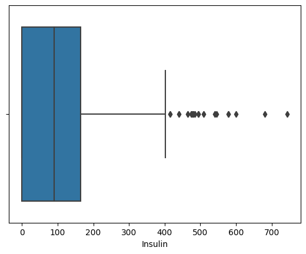

# Laporan Machine Learning Submission 1

## Domain Proyek

Diabetes melitus (DM) atau penyakit kencing manis, yang sering disebut hanya diabetes, adalah gangguan metabolisme yang ditandai dengan kadar gula darah yang tinggi dalam periode waktu yang lama.[1] Gejala umum yang terjadi yaitu sering buang air kecil, haus meningkat, dan nafsu makan meningkat.[2] Jika tidak diobati, diabetes dapat menyebabkan banyak komplikasi.[2] Komplikasi akut dapat mencakup ketoasidosis diabetik, keadaan hiperglikemik hiperosmolar, atau kematian.[3] Komplikasi jangka panjang yang serius yaitu penyakit kardiovaskular, stroke, penyakit ginjal kronis, borok kaki, kerusakan saraf, kerusakan mata, dan gangguan kognitif.[2][4]'

Glukosa adalah karbohidrat alamiah yang digunakan tubuh sebagai sumber energi. Kadar glukosa pada darah dikendalikan oleh beberapa hormon. Insulin adalah hormon yang dibuat oleh pankreas. Ketika kita makan, pankreas melepaskan insulin untuk mengirimkan pesan pada sel-sel lainnya di tubuh. Insulin ini memerintahkan sel-sel untuk memproses glukosa dari darah menjadi bentuk yang dapat dimasukkan ke dalam otot atau sel hati. Glukosa yang berlebih disimpan dalam sel-sel sebagai glikogen. Pada saat kadar gula darah mencapai tingkat rendah tertentu, sel-sel memecah glikogen menjadi glukosa untuk menghasilkan energi.

Diabetes disebabkan oleh pankreas yang tidak memproduksi cukup insulin, atau sel-sel tubuh tidak merespons dengan baik terhadap insulin yang diproduksi.[5] Terdapat tiga jenis utama diabetes mellitus:[2]

Diabetes melitus tipe 1 disebabkan karena pankreas gagal untuk memproduksi insulin yang cukup karena kehilangan sel beta (β).[2] Jenis ini sebelumnya disebut sebagai "diabetes mellitus tergantung insulin" (IDDM) atau "diabetes remaja".[2] Hilangnya sel beta disebabkan oleh respons autoimun.[6] Penyebab respons autoimun ini belum diketahui.[2]
Diabetes melitus tipe 2 dimulai dengan resistensi insulin, suatu kondisi yang mana sel-sel gagal merespons insulin dengan baik.[2] Seiring perkembangan penyakit, kekurangan insulin juga dapat terjadi.[7] Bentuk ini sebelumnya disebut sebagai "diabetes mellitus non-dependen insulin" (NIDDM) atau "diabetes onset dewasa".[2] Penyebab paling umum yaitu kombinasi dari berat badan berlebihan dan kurang olahraga.[2]
Diabetes gestasional adalah diabetes yang terjadi ketika wanita hamil. Diabetes ini terjadi pada ibu hamil yang sebelumnya tidak memiliki riwayat diabetes, namun saat hamil ibu mengalami kadar gula darah yang tinggi.[2]
Diabetes melitus tipe 1 harus dikelola dengan suntikan insulin.[2] Pencegahan dan pengobatan diabetes tipe 2 melibatkan menjaga pola makan yang sehat, olahraga fisik secara teratur, menjaga berat badan normal, dan tidak merokok.[2] Diabetes tipe 2 dapat diobati dengan Antidiabetik oral seperti sensitizer insulin dengan atau tanpa insulin.[8] Kontrol tekanan darah dalam batas normal dan menjaga perawatan kaki serta mata secara baik merupakan langkah penting bagi penderita penyakit ini.[2] Insulin dan beberapa obat oral dapat menyebabkan gula darah rendah.[9] Operasi penurunan berat badan pada orang-orang yang mengalami obesitas kadang-kadang merupakan upaya yang efektif pada mereka yang menderita diabetes tipe 2.[10] Diabetes gestasional dapat sembuh setelah kelahiran bayi, tapi disarankan ibu untuk konsultasi kepada dokter ahli terlebih dahulu.[11]

Hingga 2019, diperkirakan 463 juta orang menderita diabetes di seluruh dunia (8,8% dari populasi orang dewasa), dengan diabetes tipe 2 merupakan sekitar 90% dari kasus.[12] Tingkat kejadian serupa pada wanita dan pria.[13] Diabetes setidaknya menggandakan risiko kematian dini seseorang.[2] Pada 2019, diabetes mengakibatkan sekitar 4,2 juta kematian.[12] Pada tahun 2013, Indonesia memiliki sekitar 8,5 juta penderita diabetes yang merupakan jumlah keempat terbanyak di Asia dan nomor tujuh di dunia.[14] Dan pada tahun 2020, diperkirakan Indonesia akan memiliki 12 juta penderita diabetes, karena yang mulai terkena diabetes usianya semakin muda.

## Business Understanding

Kita pasti sudah tidak asing lagi mendengar penyakit bernama diabetes melitus (DM) atau yang sering disebut juga kencing manis. DM merupakan penyakit kronis yang ditandai dengan meningkatnya kadar gula (glukosa) darah hingga di atas normal.

Normalnya, makanan yang kita konsumsi akan diproses oleh tubuh menjadi glukosa dan digunakan sebagai energi. Hormon yang berfungsi untuk membantu glukosa diserap oleh sel-sel tubuh adalah insulin. Hormon ini dihasilkan oleh pankreas.

Namun, pada pengidap diabetes, tubuh tidak menghasilkan jumlah insulin yang cukup atau insulin tidak berfungsi sebagaimana mestinya. Kondisi inilah yang mengakibatkan peningkatan kadar gula dalam darah.

Diabetes mellitus merupakan penyakit serius yang tidak boleh disepelekan karena bisa menyebabkan komplikasi kesehatan yang fatal, seperti penyakit jantung, gagal ginjal, kebutaan, amputasi, bahkan kematian. Namun, DM sebenarnya adalah penyakit yang bisa dicegah. Salah satu caranya adalah dengan mengetahui faktor-faktor risiko diabetes mellitus di sini.

### Jenis-Jenis Diabetes Melitus

Secara umum, diabetes mellitus bisa dibedakan menjadi dua jenis, yaitu diabetes tipe 1 dan tipe 2.

Diabetes tipe 1 terjadi karena adanya kondisi autoimun, di mana sistem kekebalan tubuh pengidap sendiri yang menyerang dan menghancurkan sel-sel pankreas yang memproduksi insulin. Hal ini mengakibatkan kadar gula darah jadi meningkat, sehingga memicu terjadinya kerusakan pada organ-organ tubuh. Masih belum diketahui apa penyebab kondisi autoimun ini. Namun, dugaan paling kuat adalah karena adanya faktor genetik yang dimiliki pengidap dan ditambah lagi dengan faktor lingkungan.

Diabetes tipe 2 merupakan jenis diabetes yang lebih sering terjadi. Diabetes ini disebabkan karena sel-sel tubuh kurang sensitif terhadap insulin, sehingga insulin yang dihasilkan tidak bisa dipergunakan dengan baik (resistensi sel tubuh terhadap insulin). Hampir sebagian besar pengidap diabetes di dunia mengalami diabetes tipe 2.

Selain kedua jenis diabetes tersebut, ada juga jenis diabetes khusus pada ibu hamil yang dinamakan diabetes gestasional. Diabetes pada kehamilan ini disebabkan oleh perubahan hormon, sehingga gula darah biasanya akan kembali normal setelah ibu hamil melahirkan.

### Faktor Risiko Diabetes Melitus

Nah, setiap jenis diabetes mellitus memiliki faktor risiko yang berbeda-beda. Berikut ini faktor-faktor risiko diabetes tipe 1:

1. Memiliki anggota keluarga yang mengidap diabetes tipe 1
2. Terkena infeksi virus
3. Orang berkulit putih dipercaya lebih berisiko mengalami diabetes tipe 1 dibandingkan ras lain
4. Bepergian ke daerah yang jauh dari khatulistiwa (ekuator)
5. Usia. Meskipun diabetes tipe 1 bisa muncul pada usia berapapun, tapi penyakit ini banyak dialami oleh anak-anak berumur 4–7 tahun dan 10–14 tahun.

Sedangkan faktor risiko diabetes mellitus tipe 2 adalah sebagai berikut:

1. Mengalami obesitas atau kelebihan berat badan.
2. Memiliki riwayat keluarga dengan diabetes tipe 2.
3. Kurang aktif bergerak. Aktivitas fisik bisa membantu seseorang untuk mengontrol berat badan, membakar glukosa sebagai energi, dan membuat sel tubuh lebih sensitif terhadap insulin. Itulah mengapa, orang yang kurang beraktivitas fisik akan lebih mudah terkena diabetes tipe 2.
4. Usia. Risiko terkena diabetes tipe 2 akan meningkat seiring bertambahnya usia.
5. Mengidap tekanan darah tinggi atau hipertensi.
6. Memiliki kadar kolesterol dan trigliserida yang tidak normal. Orang yang memiliki kadar kolesterol baik atau HDL (high-density lipoprotein) yang rendah, tapi kadar trigliseridanya tinggi lebih berisiko mengalami diabetes tipe 2.
7. Mengidap polycystic ovarian syndrome (PCOS). Khusus pada wanita, memiliki riwayat penyakit PCOS membuat seorang wanita berisiko tinggi mengalami diabetes tipe 2.
8. Sedangkan pada ibu hamil, risiko mengalami diabetes gestasional semakin besar bila ibu mengidap diabetes tipe 2.

### Problem Statements

Faktor - faktor yang mempengaruhi kemungkinan terkena diabetes adalah kehamilan, glukosa, tekanan darah, ketebalan kulit, insulin, berat badan terhadap kemungkinan terkena diabetes.

- Dari serangkaian faktor yang ada, faktor apa yang paling berpengaruh terhadap penyakit Diabetes.
- Berapa besar kemungkinan terkena diabetes terhadap karakteristik atau faktor terntentu.

### Goals

- Mengetahui faktor yang paling berkorelasi dengan penyakti diabetes.
- Membuat model machine learning yang dapat memprediksi terkena diabetes seakurat mungkin berdasarkan fitur-fitur yang ada.

### Solution statements

Pengembangan model machine learning ini dilakukan dengan tiga algoritma. Kemudian, akan mengevaluasi performa masing-masing algoritma dan menentukan algoritma mana yang memberikan hasil prediksi terbaik. Ketiga algoritma yang akan di gunakan, antara lain:

1. *K-Nearest Neighbor*

- *KNN* bekerja dengan membandingkan jarak satu sampel ke sampel pelatihan lain dengan memilih sejumlah k tetangga terdekat (dengan k adalah sebuah angka positif).
- Alasan memilih algoritma KNN adalah karena algoritma ini relatif sederhana, dan mudah dimengerti untjuk pemula.

2. *Random Forest*

- *Random forest* merupakan salah satu model machine learning yang termasuk ke dalam kategori ensemble (group) learning. Apa itu model ensemble? Sederhananya, ia merupakan model prediksi yang terdiri dari beberapa model dan bekerja secara bersama-sama. Ide dibalik model ensemble adalah sekelompok model yang bekerja bersama menyelesaikan masalah. Sehingga, tingkat keberhasilan akan lebih tinggi dibanding model yang bekerja sendirian. Pada model ensemble, setiap model harus membuat prediksi secara independen. Kemudian, prediksi dari setiap model ensemble ini digabungkan untuk membuat prediksi akhir.
- Alasan memilih algoritma Random Forest adalah dapat digunakan untuk menyelesaikan masalah klasifikasi dan regresi. Random forest juga merupakan algoritma yang sering digunakan karena cukup sederhana tetapi memiliki stabilitas yang mumpuni.

3. *Boosting Algorithm*

- *Boosting Algorithm* bertujuan untuk meningkatkan performa atau akurasi prediksi. Caranya adalah dengan menggabungkan beberapa model sederhana dan dianggap lemah (weak learners) sehingga membentuk suatu model yang kuat (strong ensemble learner). Algoritma *boosting* muncul dari gagasan mengenai apakah algoritma yang sederhana seperti linear regression dan decision tree dapat dimodifikasi untuk dapat meningkatkan performa.
- Alasan pemilihan algoritma Boosting adalah hanya sebagai variasi agar lebih banyak algoritma pembanding.

## *Data Understanding*

Data yang digunakan pada proyek kali ini adalah Database dataset yang diunduh dari
https://www.kaggle.com/datasets/johndasilva/diabetes

Dataset diabetes, diambil dari rumah sakit Frankfurt, Jerman diabetes

variable yang ada pada dataset

- *Pregnancies* = Jumlah kehamilan
- *Glucose* = konsentrasi glukosa 2 jam dalam tes toleransi glukosa oral
- *BloodPressure* = Tekanan darah diastolik (mm Hg)
- *SkinThickness* = Ketebalan lipatan kulit (mm)
- *Insulin* = 2-Jam serum insulin (mu U / ml)
- *BMI* = Indeks massa tubuh (berat dalam kg / (tinggi dalam m) ^ 2)
- *DiabetesPedigreeFunction* = Riwayat keturunan diabetes
- *Age* = Umur (tahun)
- *Outcome* = Class (0 atau 1) 268 dari 768 adalah 1, yang lain adalah 0

Tahapan Pemahaman data:

### *Data Loading*

| Pregnancies | Glucose | BloodPressure | SkinThickness | Insulin | BMI | DiabetesPedigreeFunction | Age   | Outcome |
|-------------|---------|---------------|---------------|---------|-----|--------------------------|-------|---------|
| 0           | 2       | 138           | 62            | 35      | 0   | 33.6                     | 0.127 | 47      | 1   |
| 1           | 0       | 84            | 82            | 31      | 125 | 38.2                     | 0.233 | 23      | 0   |
| 2           | 0       | 145           | 0             | 0       | 0   | 44.2                     | 0.630 | 31      | 1   |
| 3           | 0       | 135           | 68            | 42      | 250 | 42.3                     | 0.365 | 24      | 1   |
| 4           | 1       | 139           | 62            | 41      | 480 | 40.7                     | 0.536 | 21      | 0   |
| ...         | ...     | ...           | ...           | ...     | ... | ...                      | ...   | ...     | ... |
| 1995        | 2       | 75            | 64            | 24      | 55  | 29.7                     | 0.370 | 33      | 0   |
| 1996        | 8       | 179           | 72            | 42      | 130 | 32.7                     | 0.719 | 36      | 1   |
| 1997        | 6       | 85            | 78            | 0       | 0   | 31.2                     | 0.382 | 42      | 0   |
| 1998        | 0       | 129           | 110           | 46      | 130 | 67.1                     | 0.319 | 26      | 1   |
| 1999        | 2       | 81            | 72            | 15      | 76  | 30.1                     | 0.547 | 25      | 0   |

Table 1. Dataset data diabetes

### *Exploratory Data Analysis* - Deskripsi Variabel

#### Deskripsi Variabel

- *Pregnancies* = Jumlah kehamilan
- *Glucose* = konsentrasi glukosa 2 jam dalam tes toleransi glukosa oral
- *BloodPressure* = Tekanan darah diastolik (mm Hg)
- *SkinThickness* = Ketebalan lipatan kulit (mm)
- *Insulin* = 2-Jam serum insulin (mu U / ml)
- *BMI* = Indeks massa tubuh (berat dalam kg / (tinggi dalam m) ^ 2)
- *DiabetesPedigreeFunction* = Riwayat keturunan diabetes
- *Age* = Umur (tahun)
- *Outcome* = *Class* (0 atau 1) 268 dari 768 adalah 1, yang lain adalah 0
  
| # |  Column                  | Non-Null Count | Dtype   |
|---|--------------------------|----------------|---------|
| 0 | Pregnancies              | 2000 non-null  | int64   |
| 1 | Glucose                  | 2000 non-null  | int64   |
| 2 | BloodPressure            | 2000 non-null  | int64   |
| 3 | SkinThickness            | 2000 non-null  | int64   |
| 4 | Insulin                  | 2000 non-null  | int64   |
| 5 | BMI                      | 2000 non-null  | float64 |
| 6 | DiabetesPedigreeFunction | 2000 non-null  | float64 |
| 7 | Age                      | 2000 non-null  | int64   |
| 8 | Outcome                  | 2000 non-null  | int64   |

Tabel 2. Tipe data dari masing - masing fitur

- Terdapat 7 kolom dengan tipe data int64 yaitu : Pregnancies, Glucose, BloodPressure, SkinThickness, Insulin, Age, Outcome.
- Terdapat 2 kolom dengan tipe data float64 yaitu : BMI, DiabetesPedigreeFunction.

Uraian di atas menunjukkan bahwa setiap kolom telah memiliki tipe data yang sesuai. Selanjutnya, mengecek deskripsi statistik data dengan fitur describe().

| Pregnancies | Glucose     | BloodPressure | SkinThickness | Insulin     | BMI         | DiabetesPedigreeFunction | Age         | Outcome     |
|-------------|-------------|---------------|---------------|-------------|-------------|--------------------------|-------------|-------------|
| count       | 2000.000000 | 2000.000000   | 2000.000000   | 2000.000000 | 2000.000000 | 2000.000000              | 2000.000000 | 2000.000000 | 2000.000000 |
| mean        | 3.703500    | 121.182500    | 69.145500     | 20.935000   | 80.254000   | 32.193000                | 0.470930    | 33.090500   | 0.342000    |
| std         | 3.306063    | 32.068636     | 19.188315     | 16.103243   | 111.180534  | 8.149901                 | 0.323553    | 11.786423   | 0.474498    |
| min         | 0.000000    | 0.000000      | 0.000000      | 0.000000    | 0.000000    | 0.000000                 | 0.078000    | 21.000000   | 0.000000    |
| 25%         | 1.000000    | 99.000000     | 63.500000     | 0.000000    | 0.000000    | 27.375000                | 0.244000    | 24.000000   | 0.000000    |
| 50%         | 3.000000    | 117.000000    | 72.000000     | 23.000000   | 40.000000   | 32.300000                | 0.376000    | 29.000000   | 0.000000    |
| 75%         | 6.000000    | 141.000000    | 80.000000     | 32.000000   | 130.000000  | 36.800000                | 0.624000    | 40.000000   | 1.000000    |
| max         | 17.000000   | 199.000000    | 122.000000    | 110.000000  | 744.000000  | 80.600000                | 2.420000    | 81.000000   | 1.000000    |

Tabel 3. Deskripsi statistik data

Fungsi describe() memberikan informasi statistik pada masing-masing kolom, antara lain:

- *Count* adalah jumlah sampel pada data.
- *Mean* adalah nilai rata-rata.
- *Std* adalah standar deviasi.
- *Min* yaitu nilai minimum setiap kolom.
- 25% adalah kuartil pertama. Kuartil adalah nilai yang menandai batas interval dalam empat bagian sebaran yang sama.
- 50% adalah kuartil kedua, atau biasa juga disebut median (nilai tengah).
- 75% adalah kuartil ketiga.
- *Max* adalah nilai maksimum.

### Menangani *Missing Value*

Terdapat *missing value* pada kolom *Pregnancies*, *Glucose*, *BloodPressure*, *SkinThickness*, *Insulin*, *BMI*

pengcekan jumlah missing value

Nilai 0 di kolom pregnancies ada:  301
Nilai 0 di kolom glucose ada:  13
Nilai 0 di kolom bloodPressure ada:  90
Nilai 0 di kolom skinThickness ada:  573
Nilai 0 di kolom insulin ada:  956
Nilai 0 di kolom bmi ada:  28
Nilai 0 di kolom age ada:  0

Catatan : Insulin tidak masuk ke pengecekan missing value karena memang ada kadar hormon insluin 0

| Pregnancies | Glucose | BloodPressure | SkinThickness | Insulin | BMI | DiabetesPedigreeFunction | Age   | Outcome |
|-------------|---------|---------------|---------------|---------|-----|--------------------------|-------|---------|
| 2           | 0       | 145           | 0             | 0       | 0   | 44.2                     | 0.630 | 31      | 1   |
| 7           | 8       | 194           | 80            | 0       | 0   | 26.1                     | 0.551 | 67      | 0   |
| 12          | 3       | 80            | 0             | 0       | 0   | 0.0                      | 0.174 | 22      | 0   |
| 13          | 6       | 166           | 74            | 0       | 0   | 26.6                     | 0.304 | 66      | 0   |
| 14          | 5       | 110           | 68            | 0       | 0   | 26.0                     | 0.292 | 30      | 0   |
| ...         | ...     | ...           | ...           | ...     | ... | ...                      | ...   | ...     | ... |
| 1985        | 0       | 131           | 88            | 0       | 0   | 31.6                     | 0.743 | 32      | 1   |
| 1988        | 4       | 120           | 68            | 0       | 0   | 29.6                     | 0.709 | 34      | 0   |
| 1989        | 4       | 110           | 66            | 0       | 0   | 31.9                     | 0.471 | 29      | 0   |
| 1991        | 6       | 102           | 82            | 0       | 0   | 30.8                     | 0.180 | 36      | 1   |
| 1997        | 6       | 85            | 78            | 0       | 0   | 31.2                     | 0.382 | 42      | 0   |

Tabel 4. Pengecekan nilai 0 pada masing - masing fitur

Di bawah ini adalah hasil dari pengecekan apakah terdapat data dengan nilai null

| Parameter                   | Nilai |
|-----------------------------|-------|
| Pregnancies                 |     0 |
| Glucose                     |     0 |
| BloodPressure               |     0 |
| SkinThickness               |     0 |
| Insulin                     |     0 |
| BMI                         |     0 |
| DiabetesPedigreeFunction    |     0 |
| Age                         |     0 |
| Outcome                     |     0 |

Tabel 5. Pengecekan data dengan nilai null

Pada tabel 5 dapat dilihat bahwa tidak ditemukan data dengan nilai *null*

Jumlah data setelah dilakukan penanganan *missing value* (1413, 9)

### Menangani *Outliers*

1. *Pregnancies*

Gambar 1. *Pregnancies Outliers*

2. *Glucose*

Gambar 2. *Pregnancies Glucose*

3. *BloodPressure*

Gambar 3. *Pregnancies BloodPressure*

*SkinThickness*

Gambar 4. *Pregnancies SkinThickness*

*Insulin*

Gambar 5. *Pregnancies Insulin*

*BMI*

Gambar 6. *Pregnancies BMI*

*DiabetesPedigreeFunction*

Gambar 6. *Pregnancies DiabetesPedigreeFunction*

*Age*

Gambar 6. *Pregnancies Age*

Pada fitur - fitur di atas terdapat beberapa outlier. Selanjutnya adalah mengatasi outliers tersebut dengan metode IQR, berikut persamaanya

Ukuran dataset setelah kita drop outliers adalah (1211, 9)

### Univariate Analysis

#### Categorical Features

##### Fitur Outcome

| # | Jumlah sampel | persentase |
|---|---------------|------------|
| 0 |           856 |       70.7 |
| 1 |           355 |       29.3 |

Table 6. Jumlah sampel dan presentase *outcome*

Gambar 7. Diagram jumlah sampel dan presentase *outcome*

Dari diagram di atas dapat disimpulkan bahwa presentase tidak terkena diabetes lebih besar dari yang terkena diabetes

#### *Numerical Features*

Gambar 8. *Histogram* masing - masing fitur

Dari *histogram* di atas dapat diamati bahwa

- Jumlah pregnan terbanyak ada di rentang 0 sampai 2
- Kandungan glukosa di atas normal (140) pada pasien lumayan banyak
- Tekanan darah pasien rata - rata normal
- Ketebalan kulit mempunyai korelasi dengna jumlah lemak di badan
- Banyak pasien yang tidak memproduksi insulin
- Riwayat keturunan diabetes paling tinggi antara rentang 0.2 - 0.3

### *Multivariate Analysis*
Multivariate EDA menunjukkan hubungan antara dua atau lebih variabel pada data. Multivariate EDA yang menunjukkan hubungan antara dua variabel biasa disebut sebagai bivariate EDA.

#### *Numerical Features*

Gambar 9. Hubungan antar fitur dengan fungsi *pairplot*

Pada gambar 9 menunjukan relasi pasangan antara fitur *Outcome* dengan fitur lainnya dalam dataset

Gambar 9. Korelasi *matrix* untuk fitur numerik

Pada gambar 9 dapat dilihat bahwa korelasi *matrix* antara "Outcome" dengan fitur lainnya hampir merata

### *Data Preparation*

#### *Train-Test-Split*

pada tahapan ini, kolom "Outcome" dijadikan target yang akan diprediksi.

10% dari data akan digunakan sebagai data uji, sedangkan 90% akan digunakan sebagai data latih.

    Total # of sample in whole dataset: 1211
    Total # of sample in train dataset: 1089
    Total # of sample in test dataset: 122

#### *Standarisasi*

| Pregnancies | Glucose   | BloodPressure | SkinThickness | Insulin   | BMI       | DiabetesPedigreeFunction | Age       |
|-------------|-----------|---------------|---------------|-----------|-----------|--------------------------|-----------|
| 1745        | -0.756534 | 0.030305      | 0.786571      | 2.018551  | 1.133288  | 0.982503                 | 2.715726  | 1.149888  |
| 1842        | 1.732485  | 1.172939      | 0.607164      | 0.362265  | -1.105880 | -0.031220                | -0.060685 | 1.581058  |
| 462         | 1.732485  | -1.515613     | -0.110461     | 1.190408  | -0.557283 | 0.421056                 | 0.951026  | 0.934302  |
| 981         | -1.112108 | 0.668836      | -0.828086     | -1.190503 | 1.245247  | -1.637581                | -0.971996 | -1.005966 |
| 501         | -0.045386 | -1.179544     | 0.068945      | 0.362265  | -1.105880 | 0.717375                 | -0.740307 | -0.251417 |

Tabel 7. Standarisasi

| Pregnancies | Glucose   | BloodPressure | SkinThickness | Insulin   | BMI       | DiabetesPedigreeFunction | Age       |
|-------------|-----------|---------------|---------------|-----------|-----------|--------------------------|-----------|
| count       | 1089.0000 | 1089.0000     | 1089.0000     | 1089.0000 | 1089.0000 | 1089.0000                | 1089.0000 | 1089.0000 |
| mean        | 0.0000    | 0.0000        | -0.0000       | 0.0000    | 0.0000    | 0.0000                   | 0.0000    | 0.0000    |
| std         | 1.0005    | 1.0005        | 1.0005        | 1.0005    | 1.0005    | 1.0005                   | 1.0005    | 1.0005    |
| min         | -1.1121   | -2.1205       | -2.8016       | -2.2257   | -1.1059   | -2.2458                  | -1.4431   | -1.0060   |
| 25%         | -0.7565   | -0.7090       | -0.6487       | -0.7764   | -1.1059   | -0.7486                  | -0.7751   | -0.7904   |
| 50%         | -0.4010   | -0.2049       | -0.1105       | 0.0517    | -0.1318   | 0.0312                   | -0.2267   | -0.3592   |
| 75%         | 0.6658    | 0.6016        | 0.6072        | 0.7763    | 0.6295    | 0.6082                   | 0.5958    | 0.6109    |
| max         | 2.7992    | 2.6516        | 2.9394        | 2.6397    | 3.3948    | 2.8228                   | 2.9551    | 3.1979    |

Tabel 8. Pengecekan standar deviasi

Pada tabel 8 dapat dilihat bahwa standarisasi menghasilkan distribusi dengan standar deviasi sama dengan 1 dan mean sama dengan 0. Sekitar 68% dari nilai akan berada di antara -1 dan 1.

### *Model Development*

#### *Model Development dengan K-Nearest Neighbor*

*K-Nearest Neighbors Algoritma KNN* merupakan metode yang digunakan untuk melakukan klasifikasi data berdasarkan jarak terpendek terhadap objek data. Penentuan nilai K yang terbaik untuk algoritma ini berdasarkan pada data yang ada. Nilai K yang tinggi dapat mengurangi efek noise pada klasifikasi, bisa juga membuat batasan antara setiap klasifikasi menjadi lebih kabur. [15]
* Kelebihan:
  - Sederhana dan mudah diimplementasikan.
  - Tidak memerlukan asumsi tentang distribusi data.
  - Mampu menangani data dengan fitur yang kompleks atau non-linear.
  - Fleksibel dalam menangani masalah klasifikasi dan regresi.
  - Kinerja yang baik pada dataset dengan ukuran kecil hingga sedang.
* Kekurangan:
  - Sensitif terhadap data pencilan (outliers) karena menghitung jarak - terhadap tetangga terdekat.
  - Membutuhkan penghitungan jarak terhadap semua titik data saat melakukan prediksi, yang dapat menjadi komputasi yang mahal pada dataset yang besar.
  - Tidak efisien dalam hal ruang karena membutuhkan penyimpanan seluruh dataset pelatihan.
  - Perlu menentukan parameter k untuk jumlah tetangga yang akan digunakan, yang bisa mempengaruhi kinerja algoritma.
* Parameter:
  - n_neighbors = 10

#### Model Development dengan Random Forest
*Random forest* adalah kombinasi pohon prediktor sedemikian rupa sehingga setiap pohon bergantung pada nilai sebuah sampel vektor acak secara independen dan dengan distribusi yang sama untuk semua pohon di *forest*. [16]
- Kelebihan:
  - Tahan terhadap _overfitting_.
  - Stabilitas dan kinerja yang tinggi.
  - Kemampuan menangani data yang tidak seimbang.
  - Kemampuan untuk mengevaluasi pentingnya fitur.
- Kekurangan:
  - Interpretabilitas yang terbatas.
  - Membutuhkan lebih banyak sumber daya.
  - Tidak efektif untuk data dengan dimensi tinggi.
- Parameter:
  - n_estimator: jumlah trees (pohon) di forest. Di sini kita set n_estimator=50.
  - max_depth: kedalaman atau panjang pohon. Ia merupakan ukuran seberapa banyak pohon dapat membelah (splitting) untuk membagi setiap node ke dalam jumlah pengamatan yang diinginkan. max_depth=16
  - random_state: digunakan untuk mengontrol random number generator yang digunakan. random_state=55
  - n_jobs: jumlah job (pekerjaan) yang digunakan secara paralel. Ia merupakan komponen untuk mengontrol thread atau proses yang berjalan secara paralel. n_jobs=-1 artinya semua proses berjalan secara paralel. n_jobs=-1

#### Model Development dengan Boosting Algorithm

*Gradient boosting* merupakan algoritma klasifikasi machine learning yang menggunakan ensamble dari decision tree untuk memprediksi nilai. Gradient boosting termasuk supervised learning berbasis decision tree yang dapat digunakan untuk klasifikasi. Gradient boosting dimulai dengan menghasilkan pohon klasifikasi awal dan terus menyesuaikan pohon baru melalui minimalisasi fungsi kerugian. [4]
* Kelebihan:
  - Menangani berbagai jenis data.
  - Menangani interaksi fitur.
  - Tidak terlalu sensitif terhadap preprocessing.
* Kekurangan:
  - Waktu pelatihan yang lama.
  - Kemungkinan overfitting.
  - Sensitif terhadap parameter.
* Parameter:
  - learning_rate: bobot yang diterapkan pada setiap regressor di masing-masing proses iterasi boosting. learning_rate=0.05
  - random_state: digunakan untuk mengontrol random number generator yang digunakan. random_state=55

#### Evaluasi Model

Mengevaluasi model regresi sebenarnya relatif sederhana. Secara umum, hampir semua metrik adalah sama. Jika prediksi mendekati nilai sebenarnya, performanya baik. Sedangkan jika tidak, performanya buruk. Secara teknis, selisih antara nilai sebenarnya dan nilai prediksi disebut eror. Maka, semua metrik mengukur seberapa kecil nilai eror tersebut.

Metrik yang akan digunakan pada prediksi ini adalah *MSE* atau* Mean Squared Error* yang menghitung jumlah selisih kuadrat rata-rata nilai sebenarnya dengan nilai prediksi. *MSE* didefinisikan dalam persamaan berikut

$$ MSE = {1/N \sum_{k=1}^n (y_i - ypred_i)^2 } $$

Keterangan:

N = jumlah dataset

yi = nilai sebenarnya

ypred = nilai prediksi

Sebelum menghitung nilai MSE dalam model, dilakukan proses scaling fitur numerik pada data uji, kemudian mengevaluasi ketiga model dengan matrik MSE

|          | train    | test     |
|----------|----------|----------|
| KNN      | 0.000094 | 0.000122 |
| RF       | 0.000003 | 0.000011 |
| Boosting | 0.0001   | 0.000121 |

Tabel 9. Hasil evaluasi pada data latih dan data test

Gambar 10. Diagram prediksi

Dari gambar di atas, terlihat bahwa, model Random Forest (RF) memberikan nilai eror yang paling kecil. Sedangkan model dengan algoritma Boosting dan algoritma KNN hampir sama.

|        | y_true | prediksi_KNN | prediksi_RF | prediksi_Boosting |
|--------|--------------|-------------|-------------------|-----|
| 1652   | 1            | 0.6         | 1.0               | 0.9 |

Tabel 10. Hasil pengujian model

Dari tabel 10 terlihat bahwa prediksi dengan *Random Forest (RF)* memberikan hasil yang paling mendekati.

### Daftar Refrensi
1. *"About diabetes". World Health Organization*. Diarsipkan dari versi asli tanggal 31 March 2014. Diakses tanggal 4 April 2014.
2. *"Diabetes Fact sheet N°312". WHO. October 2013*. Diarsipkan dari versi asli tanggal 26 August 2013. Diakses tanggal 25 March 2014.
Kitabchi AE, Umpierrez GE, Miles JM, Fisher JN (July 2009). 
3. "Hyperglycemic crises in adult patients with diabetes". Diabetes Care. 32 (7): 1335–43. doi:10.2337/dc09-9032. PMC 2699725 alt=Dapat diakses gratis. PMID 19564476.
4. Saedi, E; Gheini, MR; Faiz, F; Arami, MA (15 September 2016). "Diabetes mellitus and cognitive impairments". World Journal of Diabetes. 7 (17): 412–22. doi:10.4239/wjd.v7.i17.412. PMC 5027005 alt=Dapat diakses gratis. PMID 27660698.
5. Shoback DG, Gardner D, ed. (2011). "Chapter 17". Greenspan's basic & clinical endocrinology (edisi ke-9th). New York: McGraw-Hill Medical. ISBN 978-0-07-162243-1.
6. Norman A, Henry H (2015). Hormones. Elsevier. hlm. 136–137. ISBN 9780123694447.
7. *RSSDI textbook of diabetes mellitus (edisi ke-Revised 2nd). Jaypee Brothers Medical Publishers*. 2012. hlm. 235. ISBN 978-93-5025-489-9. Diarsipkan dari versi asli tanggal 14 October 2015.
8. *"The top 10 causes of death Fact sheet N°310". World Health Organization*. October 2013. Diarsipkan dari versi asli tanggal 30 May 2017.
9. Rippe RS, Irwin JM, ed. (2010). *Manual of intensive care medicine* (edisi ke-5th). Wolters Kluwer Health/Lippincott Williams & Wilkins. hlm. 549. ISBN 978-0-7817-9992-8.
10. Picot J, Jones J, Colquitt JL, Gospodarevskaya E, Loveman E, Baxter L, Clegg AJ (September 2009). *"The clinical effectiveness and cost-effectiveness of bariatric (weight loss) surgery for obesity: a systematic review and economic evaluation". Health Technology Assessment*. 13 (41): 1–190, 215–357, iii–iv. doi:10.3310/hta13410. PMID 19726018.
11. Cash, Jill (2014). *Family Practice Guidelines* (edisi ke-3rd). Springer. hlm. 396. ISBN 978-0-8261-6875-7. Diarsipkan dari versi asli tanggal 31 October 2015.
12. *"IDF DIABETES ATLAS Ninth Edition 2019"* (PDF). www.diabetesatlas.org (dalam bahasa Inggris). Diakses tanggal 18 May 2020.
13. Vos T, Flaxman AD, Naghavi M, Lozano R, Michaud C, Ezzati M, et al. (December 2012). *"Years lived with disability (YLDs) for 1160 sequelae of 289 diseases and injuries 1990–2010: a systematic analysis for the Global Burden of Disease Study 2010". Lancet*. 380 (9859): 2163–96. doi:10.1016/S0140-6736(12)61729-2. PMC 6350784 alt=Dapat diakses gratis. PMID 23245607.
14. *"Simple treatment to curb diabetes"*. January 20, 2014. Diarsipkan dari versi asli tanggal 2014-02-02. Diakses tanggal 2014-01-20.
15. Breiman, L. 2022. Random Forest. *Machine Learning*. 45: 5-32.
16.  Febryananda, A.R. 2022. Mengenal Teknik *Gradient Boosting* dalam Algoritma *Machine Learning.* Laboratorium Analisis Data dan Rekaya Kualitas. [link](https://lab_adrk.ub.ac.id/id/mengenal-teknik-gradient-boosting-dalam-algoritma-machine-learning/). [accessed May. 29 2023]