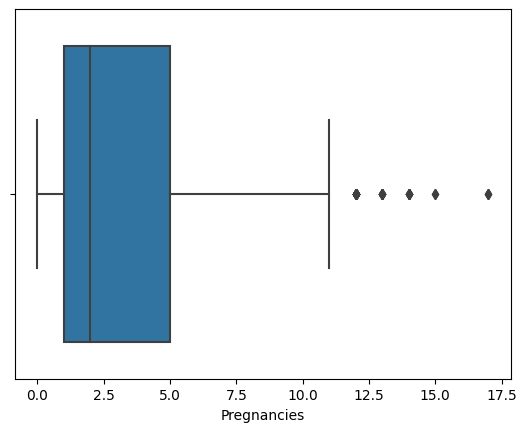
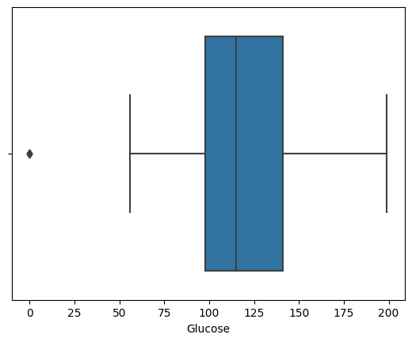
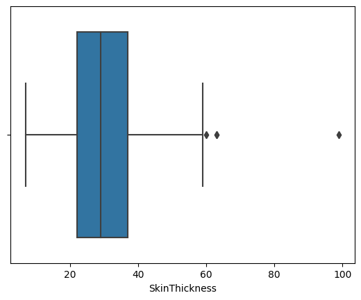
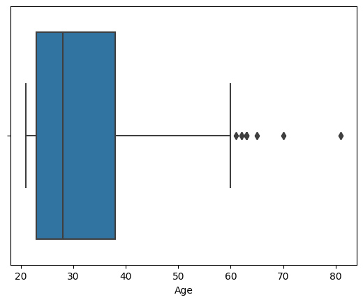
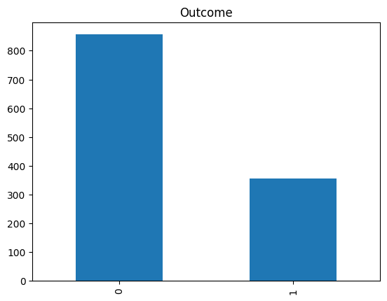
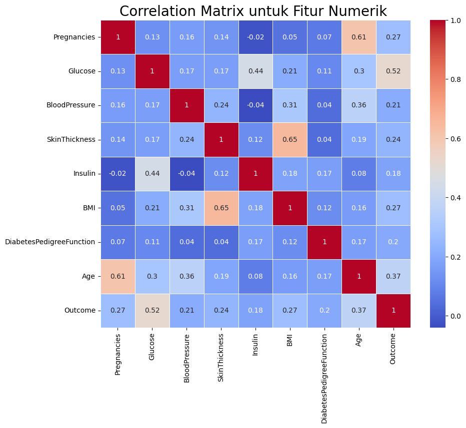
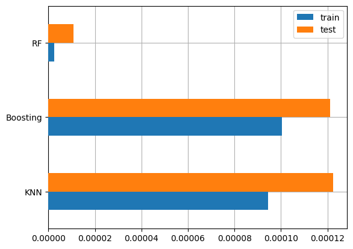

# Laporan Machine Learning Submission 1

## Domain Proyek

Diabetes atau penyakit gula (gula darah tinggi) adalah penyakit kronis (jangka panjang) yang perlu kita waspadai. Adapun tanda utama dari penyakit ini adalah meningkatnya kadar gula darah (glukosa) melebihi nilai normal. Diabetes terjadi ketika tubuh pengidapnya tidak lagi mampu mengambil gula (glukosa) ke dalam sel dan menggunakannya sebagai energi. Kondisi ini pada akhirnya menghasilkan penumpukan gula ekstra dalam aliran darah tubuh. (sumber: halodoc.com)

Penyakit diabetes yang tidak terkontrol dengan baik dapat menyebabkan konsekuensi serius, menyebabkan kerusakan pada berbagai organ dan jaringan tubuh. Contohnya organ seperti jantung, ginjal, mata, dan saraf. (sumber: halodoc.com)

Menurut Organisasi Kesehatan Dunia (WHO) diabetes melitus merupakan penyakit kronis serius yang terjadi karena pankreas tidak menghasilkan cukup insulin (hormon yang mengatur gula darah atau glukosa) atau ketika tubuh tidak dapat secara efektif menggunakan insulin yang dihasilkannya. (sumber: detik.com)

Diabetes sendiri sering dijuluki dengan penyakit 'silent killer' lantaran pengidapnya sering mengabaikan gejala awalnya. Selain itu, diabetes juga merupakan penyakit kronis yang paling tinggi kenaikan angka prevalensinya saat ini dan masuk ke dalam daftar 10 penyebab kematian di dunia. (sumber: detik.com)

## Business Understanding

Kita pasti sudah tidak asing lagi mendengar penyakit bernama diabetes melitus (DM) atau yang sering disebut juga kencing manis. DM merupakan penyakit kronis yang ditandai dengan meningkatnya kadar gula (glukosa) darah hingga di atas normal.

Normalnya, makanan yang kita konsumsi akan diproses oleh tubuh menjadi glukosa dan digunakan sebagai energi. Hormon yang berfungsi untuk membantu glukosa diserap oleh sel-sel tubuh adalah insulin. Hormon ini dihasilkan oleh pankreas.

Namun, pada pengidap diabetes, tubuh tidak menghasilkan jumlah insulin yang cukup atau insulin tidak berfungsi sebagaimana mestinya. Kondisi inilah yang mengakibatkan peningkatan kadar gula dalam darah.

Diabetes mellitus merupakan penyakit serius yang tidak boleh disepelekan karena bisa menyebabkan komplikasi kesehatan yang fatal, seperti penyakit jantung, gagal ginjal, kebutaan, amputasi, bahkan kematian. Namun, DM sebenarnya adalah penyakit yang bisa dicegah. Salah satu caranya adalah dengan mengetahui faktor-faktor risiko diabetes mellitus di sini.

### Jenis-Jenis Diabetes Melitus

Secara umum, diabetes mellitus bisa dibedakan menjadi dua jenis, yaitu diabetes tipe 1 dan tipe 2.

Diabetes tipe 1 terjadi karena adanya kondisi autoimun, di mana sistem kekebalan tubuh pengidap sendiri yang menyerang dan menghancurkan sel-sel pankreas yang memproduksi insulin. Hal ini mengakibatkan kadar gula darah jadi meningkat, sehingga memicu terjadinya kerusakan pada organ-organ tubuh. Masih belum diketahui apa penyebab kondisi autoimun ini. Namun, dugaan paling kuat adalah karena adanya faktor genetik yang dimiliki pengidap dan ditambah lagi dengan faktor lingkungan.

Diabetes tipe 2 merupakan jenis diabetes yang lebih sering terjadi. Diabetes ini disebabkan karena sel-sel tubuh kurang sensitif terhadap insulin, sehingga insulin yang dihasilkan tidak bisa dipergunakan dengan baik (resistensi sel tubuh terhadap insulin). Hampir sebagian besar pengidap diabetes di dunia mengalami diabetes tipe 2.

Selain kedua jenis diabetes tersebut, ada juga jenis diabetes khusus pada ibu hamil yang dinamakan diabetes gestasional. Diabetes pada kehamilan ini disebabkan oleh perubahan hormon, sehingga gula darah biasanya akan kembali normal setelah ibu hamil melahirkan.

### Faktor Risiko Diabetes Melitus

Nah, setiap jenis diabetes mellitus memiliki faktor risiko yang berbeda-beda. Berikut ini faktor-faktor risiko diabetes tipe 1:

1. Memiliki anggota keluarga yang mengidap diabetes tipe 1
2. Terkena infeksi virus
3. Orang berkulit putih dipercaya lebih berisiko mengalami diabetes tipe 1 dibandingkan ras lain
4. Bepergian ke daerah yang jauh dari khatulistiwa (ekuator)
5. Usia. Meskipun diabetes tipe 1 bisa muncul pada usia berapapun, tapi penyakit ini banyak dialami oleh anak-anak berumur 4–7 tahun dan 10–14 tahun.

Sedangkan faktor risiko diabetes mellitus tipe 2 adalah sebagai berikut:

1. Mengalami obesitas atau kelebihan berat badan.
2. Memiliki riwayat keluarga dengan diabetes tipe 2.
3. Kurang aktif bergerak. Aktivitas fisik bisa membantu seseorang untuk mengontrol berat badan, membakar glukosa sebagai energi, dan membuat sel tubuh lebih sensitif terhadap insulin. Itulah mengapa, orang yang kurang beraktivitas fisik akan lebih mudah terkena diabetes tipe 2.
4. Usia. Risiko terkena diabetes tipe 2 akan meningkat seiring bertambahnya usia.
5. Mengidap tekanan darah tinggi atau hipertensi.
6. Memiliki kadar kolesterol dan trigliserida yang tidak normal. Orang yang memiliki kadar kolesterol baik atau HDL (high-density lipoprotein) yang rendah, tapi kadar trigliseridanya tinggi lebih berisiko mengalami diabetes tipe 2.
7. Mengidap polycystic ovarian syndrome (PCOS). Khusus pada wanita, memiliki riwayat penyakit PCOS membuat seorang wanita berisiko tinggi mengalami diabetes tipe 2.
8. Sedangkan pada ibu hamil, risiko mengalami diabetes gestasional semakin besar bila ibu mengidap diabetes tipe 2.

Sumber : https://www.halodoc.com/artikel/12-faktor-ini-tingkatkan-risiko-diabetes-melitus

### Problem Statements

Faktor - faktor yang mempengaruhi kemungkinan terkena diabetes adalah kehamilan, glukosa, tekanan darah, ketebalan kulit, insulin, berat badan terhadap kemungkinan terkena diabetes.

- Dari serangkaian faktor yang ada, faktor apa yang paling berpengaruh terhadap penyakit Diabetes.
- Berapa besar kemungkinan terkena diabetes terhadap karakteristik atau faktor terntentu.

### Goals

- Mengetahui faktor yang paling berkorelasi dengan penyakti diabetes.
- Membuat model machine learning yang dapat memprediksi terkena diabetes seakurat mungkin berdasarkan fitur-fitur yang ada.

### Solution statements

kita akan mengembangkan model machine learning dengan tiga algoritma. Kemudian, kita akan mengevaluasi performa masing-masing algoritma dan menentukan algoritma mana yang memberikan hasil prediksi terbaik. Ketiga algoritma yang akan kita gunakan, antara lain:

1. K-Nearest Neighbor
2. Random Forest
3. Boosting Algorithm

## Data Understanding

Data yang saya gunakan pada proyek kali ini adalah Database dataset yang diunduh dari
https://www.kaggle.com/datasets/johndasilva/diabetes

Dataset diabetes, diambil dari rumah sakit Frankfurt, Jerman diabetes

variable yang ada pada dataset

- Pregnancies = Jumlah kehamilan
- Glucose = konsentrasi glukosa 2 jam dalam tes toleransi glukosa oral
- BloodPressure = Tekanan darah diastolik (mm Hg)
- SkinThickness = Ketebalan lipatan kulit (mm)
- Insulin = 2-Jam serum insulin (mu U / ml)
- BMI = Indeks massa tubuh (berat dalam kg / (tinggi dalam m) ^ 2)
- DiabetesPedigreeFunction = Riwayat keturunan diabetes
- Age = Umur (tahun)
- Variabel Outcome = Class (0 atau 1) 268 dari 768 adalah 1, yang lain adalah 0

Tahapan Pemahaman data:

### Data Loading

```python
import numpy as np # linear algebra
import pandas as pd # data processing, CSV file I/O (e.g. pd.read_csv)
import matplotlib.pyplot as plt
import seaborn as sns
```

```python
url = 'diabetes-2.csv'
datadm = pd.read_csv(url)
datadm
```

  <div id="df-8fad59a0-3cee-4a4b-864b-4fb85a81f25b">
    <div class="colab-df-container">
      <div>
<table border="1" class="dataframe">
  <thead>
    <tr style="text-align: right;">
      <th></th>
      <th>Pregnancies</th>
      <th>Glucose</th>
      <th>BloodPressure</th>
      <th>SkinThickness</th>
      <th>Insulin</th>
      <th>BMI</th>
      <th>DiabetesPedigreeFunction</th>
      <th>Age</th>
      <th>Outcome</th>
    </tr>
  </thead>
  <tbody>
    <tr>
      <th>0</th>
      <td>2</td>
      <td>138</td>
      <td>62</td>
      <td>35</td>
      <td>0</td>
      <td>33.6</td>
      <td>0.127</td>
      <td>47</td>
      <td>1</td>
    </tr>
    <tr>
      <th>1</th>
      <td>0</td>
      <td>84</td>
      <td>82</td>
      <td>31</td>
      <td>125</td>
      <td>38.2</td>
      <td>0.233</td>
      <td>23</td>
      <td>0</td>
    </tr>
    <tr>
      <th>2</th>
      <td>0</td>
      <td>145</td>
      <td>0</td>
      <td>0</td>
      <td>0</td>
      <td>44.2</td>
      <td>0.630</td>
      <td>31</td>
      <td>1</td>
    </tr>
    <tr>
      <th>3</th>
      <td>0</td>
      <td>135</td>
      <td>68</td>
      <td>42</td>
      <td>250</td>
      <td>42.3</td>
      <td>0.365</td>
      <td>24</td>
      <td>1</td>
    </tr>
    <tr>
      <th>4</th>
      <td>1</td>
      <td>139</td>
      <td>62</td>
      <td>41</td>
      <td>480</td>
      <td>40.7</td>
      <td>0.536</td>
      <td>21</td>
      <td>0</td>
    </tr>
    <tr>
      <th>...</th>
      <td>...</td>
      <td>...</td>
      <td>...</td>
      <td>...</td>
      <td>...</td>
      <td>...</td>
      <td>...</td>
      <td>...</td>
      <td>...</td>
    </tr>
    <tr>
      <th>1995</th>
      <td>2</td>
      <td>75</td>
      <td>64</td>
      <td>24</td>
      <td>55</td>
      <td>29.7</td>
      <td>0.370</td>
      <td>33</td>
      <td>0</td>
    </tr>
    <tr>
      <th>1996</th>
      <td>8</td>
      <td>179</td>
      <td>72</td>
      <td>42</td>
      <td>130</td>
      <td>32.7</td>
      <td>0.719</td>
      <td>36</td>
      <td>1</td>
    </tr>
    <tr>
      <th>1997</th>
      <td>6</td>
      <td>85</td>
      <td>78</td>
      <td>0</td>
      <td>0</td>
      <td>31.2</td>
      <td>0.382</td>
      <td>42</td>
      <td>0</td>
    </tr>
    <tr>
      <th>1998</th>
      <td>0</td>
      <td>129</td>
      <td>110</td>
      <td>46</td>
      <td>130</td>
      <td>67.1</td>
      <td>0.319</td>
      <td>26</td>
      <td>1</td>
    </tr>
    <tr>
      <th>1999</th>
      <td>2</td>
      <td>81</td>
      <td>72</td>
      <td>15</td>
      <td>76</td>
      <td>30.1</td>
      <td>0.547</td>
      <td>25</td>
      <td>0</td>
    </tr>
  </tbody>
</table>
<p>2000 rows × 9 columns</p>
</div>
    </div>
  </div>

### Exploratory Data Analysis - Deskripsi Variabel

#### Deskripsi Variabel

- Pregnancies = Jumlah kehamilan
- Glucose = konsentrasi glukosa 2 jam dalam tes toleransi glukosa oral
- BloodPressure = Tekanan darah diastolik (mm Hg)
- SkinThickness = Ketebalan lipatan kulit (mm)
- Insulin = 2-Jam serum insulin (mu U / ml)
- BMI = Indeks massa tubuh (berat dalam kg / (tinggi dalam m) ^ 2)
- DiabetesPedigreeFunction = Riwayat keturunan diabetes
- Age = Umur (tahun)
- Variabel Outcome = Class (0 atau 1) 268 dari 768 adalah 1, yang lain adalah 0

```python
datadm.info()
```

    <class 'pandas.core.frame.DataFrame'>
    RangeIndex: 2000 entries, 0 to 1999
    Data columns (total 9 columns):
     #   Column                    Non-Null Count  Dtype
    ---  ------                    --------------  -----
     0   Pregnancies               2000 non-null   int64
     1   Glucose                   2000 non-null   int64
     2   BloodPressure             2000 non-null   int64
     3   SkinThickness             2000 non-null   int64
     4   Insulin                   2000 non-null   int64
     5   BMI                       2000 non-null   float64
     6   DiabetesPedigreeFunction  2000 non-null   float64
     7   Age                       2000 non-null   int64
     8   Outcome                   2000 non-null   int64
    dtypes: float64(2), int64(7)
    memory usage: 140.8 KB

- Terdapat 7 kolom dengan tipe data int64 yaitu : Pregnancies, Glucose, BloodPressure, SkinThickness, Insulin, Age, Outcome.
- Terdapat 2 kolom dengan tipe data float64 yaitu : BMI, DiabetesPedigreeFunction.

Uraian di atas menunjukkan bahwa setiap kolom telah memiliki tipe data yang sesuai. Selanjutnya, mengecek deskripsi statistik data dengan fitur describe().

```python
datadm.describe()
```

  <div id="df-e6a4ff4d-b365-43a9-a2a8-c7c64be5ed43">
    <div class="colab-df-container">
      <div>

<table border="1" class="dataframe">
  <thead>
    <tr style="text-align: right;">
      <th></th>
      <th>Pregnancies</th>
      <th>Glucose</th>
      <th>BloodPressure</th>
      <th>SkinThickness</th>
      <th>Insulin</th>
      <th>BMI</th>
      <th>DiabetesPedigreeFunction</th>
      <th>Age</th>
      <th>Outcome</th>
    </tr>
  </thead>
  <tbody>
    <tr>
      <th>count</th>
      <td>2000.000000</td>
      <td>2000.000000</td>
      <td>2000.000000</td>
      <td>2000.000000</td>
      <td>2000.000000</td>
      <td>2000.000000</td>
      <td>2000.000000</td>
      <td>2000.000000</td>
      <td>2000.000000</td>
    </tr>
    <tr>
      <th>mean</th>
      <td>3.703500</td>
      <td>121.182500</td>
      <td>69.145500</td>
      <td>20.935000</td>
      <td>80.254000</td>
      <td>32.193000</td>
      <td>0.470930</td>
      <td>33.090500</td>
      <td>0.342000</td>
    </tr>
    <tr>
      <th>std</th>
      <td>3.306063</td>
      <td>32.068636</td>
      <td>19.188315</td>
      <td>16.103243</td>
      <td>111.180534</td>
      <td>8.149901</td>
      <td>0.323553</td>
      <td>11.786423</td>
      <td>0.474498</td>
    </tr>
    <tr>
      <th>min</th>
      <td>0.000000</td>
      <td>0.000000</td>
      <td>0.000000</td>
      <td>0.000000</td>
      <td>0.000000</td>
      <td>0.000000</td>
      <td>0.078000</td>
      <td>21.000000</td>
      <td>0.000000</td>
    </tr>
    <tr>
      <th>25%</th>
      <td>1.000000</td>
      <td>99.000000</td>
      <td>63.500000</td>
      <td>0.000000</td>
      <td>0.000000</td>
      <td>27.375000</td>
      <td>0.244000</td>
      <td>24.000000</td>
      <td>0.000000</td>
    </tr>
    <tr>
      <th>50%</th>
      <td>3.000000</td>
      <td>117.000000</td>
      <td>72.000000</td>
      <td>23.000000</td>
      <td>40.000000</td>
      <td>32.300000</td>
      <td>0.376000</td>
      <td>29.000000</td>
      <td>0.000000</td>
    </tr>
    <tr>
      <th>75%</th>
      <td>6.000000</td>
      <td>141.000000</td>
      <td>80.000000</td>
      <td>32.000000</td>
      <td>130.000000</td>
      <td>36.800000</td>
      <td>0.624000</td>
      <td>40.000000</td>
      <td>1.000000</td>
    </tr>
    <tr>
      <th>max</th>
      <td>17.000000</td>
      <td>199.000000</td>
      <td>122.000000</td>
      <td>110.000000</td>
      <td>744.000000</td>
      <td>80.600000</td>
      <td>2.420000</td>
      <td>81.000000</td>
      <td>1.000000</td>
    </tr>
  </tbody>
</table>
</div>

</div>

  </div>

Fungsi describe() memberikan informasi statistik pada masing-masing kolom, antara lain:

- Count adalah jumlah sampel pada data.
- Mean adalah nilai rata-rata.
- Std adalah standar deviasi.
- Min yaitu nilai minimum setiap kolom.
- 25% adalah kuartil pertama. Kuartil adalah nilai yang menandai batas interval dalam empat bagian sebaran yang sama.
- 50% adalah kuartil kedua, atau biasa juga disebut median (nilai tengah).
- 75% adalah kuartil ketiga.
- Max adalah nilai maksimum.

### Exploratory Data Analysis - Menangani Missing Value

Terdapat missing value pada kolom Pregnancies, Glucose, BloodPressure, SkinThickness, Insulin, BMI

pengcekan jumlah missing value

```python
pregnancies = (datadm.Pregnancies == 0).sum()
glucose = (datadm.Glucose == 0).sum()
bloodPressure = (datadm.BloodPressure == 0).sum()
skinThickness = (datadm.SkinThickness == 0).sum()
insulin = (datadm.Insulin == 0).sum()
bmi = (datadm.BMI == 0).sum()
age = (datadm.Age == 0).sum()

print("Nilai 0 di kolom pregnancies ada: ", pregnancies)
print("Nilai 0 di kolom glucose ada: ", glucose)
print("Nilai 0 di kolom bloodPressure ada: ", bloodPressure)
print("Nilai 0 di kolom skinThickness ada: ", skinThickness)
print("Nilai 0 di kolom insulin ada: ", insulin)
print("Nilai 0 di kolom bmi ada: ", bmi)
print("Nilai 0 di kolom age ada: ", age)
```

    Nilai 0 di kolom pregnancies ada:  301
    Nilai 0 di kolom glucose ada:  13
    Nilai 0 di kolom bloodPressure ada:  90
    Nilai 0 di kolom skinThickness ada:  573
    Nilai 0 di kolom insulin ada:  956
    Nilai 0 di kolom bmi ada:  28
    Nilai 0 di kolom age ada:  0

Catatan : Insulin tidak masuk ke pengecekan missing value karena memang ada kadar hormon insluin 0

```python
datadm.loc[(datadm['SkinThickness']==0)]
```

  <div id="df-6978059f-8738-4502-b1ba-0775ba4644f9">
    <div class="colab-df-container">
      <div>

<table border="1" class="dataframe">
  <thead>
    <tr style="text-align: right;">
      <th></th>
      <th>Pregnancies</th>
      <th>Glucose</th>
      <th>BloodPressure</th>
      <th>SkinThickness</th>
      <th>Insulin</th>
      <th>BMI</th>
      <th>DiabetesPedigreeFunction</th>
      <th>Age</th>
      <th>Outcome</th>
    </tr>
  </thead>
  <tbody>
    <tr>
      <th>2</th>
      <td>0</td>
      <td>145</td>
      <td>0</td>
      <td>0</td>
      <td>0</td>
      <td>44.2</td>
      <td>0.630</td>
      <td>31</td>
      <td>1</td>
    </tr>
    <tr>
      <th>7</th>
      <td>8</td>
      <td>194</td>
      <td>80</td>
      <td>0</td>
      <td>0</td>
      <td>26.1</td>
      <td>0.551</td>
      <td>67</td>
      <td>0</td>
    </tr>
    <tr>
      <th>12</th>
      <td>3</td>
      <td>80</td>
      <td>0</td>
      <td>0</td>
      <td>0</td>
      <td>0.0</td>
      <td>0.174</td>
      <td>22</td>
      <td>0</td>
    </tr>
    <tr>
      <th>13</th>
      <td>6</td>
      <td>166</td>
      <td>74</td>
      <td>0</td>
      <td>0</td>
      <td>26.6</td>
      <td>0.304</td>
      <td>66</td>
      <td>0</td>
    </tr>
    <tr>
      <th>14</th>
      <td>5</td>
      <td>110</td>
      <td>68</td>
      <td>0</td>
      <td>0</td>
      <td>26.0</td>
      <td>0.292</td>
      <td>30</td>
      <td>0</td>
    </tr>
    <tr>
      <th>...</th>
      <td>...</td>
      <td>...</td>
      <td>...</td>
      <td>...</td>
      <td>...</td>
      <td>...</td>
      <td>...</td>
      <td>...</td>
      <td>...</td>
    </tr>
    <tr>
      <th>1985</th>
      <td>0</td>
      <td>131</td>
      <td>88</td>
      <td>0</td>
      <td>0</td>
      <td>31.6</td>
      <td>0.743</td>
      <td>32</td>
      <td>1</td>
    </tr>
    <tr>
      <th>1988</th>
      <td>4</td>
      <td>120</td>
      <td>68</td>
      <td>0</td>
      <td>0</td>
      <td>29.6</td>
      <td>0.709</td>
      <td>34</td>
      <td>0</td>
    </tr>
    <tr>
      <th>1989</th>
      <td>4</td>
      <td>110</td>
      <td>66</td>
      <td>0</td>
      <td>0</td>
      <td>31.9</td>
      <td>0.471</td>
      <td>29</td>
      <td>0</td>
    </tr>
    <tr>
      <th>1991</th>
      <td>6</td>
      <td>102</td>
      <td>82</td>
      <td>0</td>
      <td>0</td>
      <td>30.8</td>
      <td>0.180</td>
      <td>36</td>
      <td>1</td>
    </tr>
    <tr>
      <th>1997</th>
      <td>6</td>
      <td>85</td>
      <td>78</td>
      <td>0</td>
      <td>0</td>
      <td>31.2</td>
      <td>0.382</td>
      <td>42</td>
      <td>0</td>
    </tr>
  </tbody>
</table>
<p>573 rows × 9 columns</p>
</div>
</div>
  </div>

```python
datadm.isnull().sum()
```

    Pregnancies                 0
    Glucose                     0
    BloodPressure               0
    SkinThickness               0
    Insulin                     0
    BMI                         0
    DiabetesPedigreeFunction    0
    Age                         0
    Outcome                     0
    dtype: int64

```python
datadm = datadm.loc[(datadm[['BloodPressure','SkinThickness','BMI']]!=0).all(axis=1)]
```

```python
datadm.shape
```

    (1413, 9)

### Exploratory Data Analysis - Menangani Missing Value

```python
sns.boxplot(x=datadm['Pregnancies'])
```

    <Axes: xlabel='Pregnancies'>



```python
sns.boxplot(x=datadm['Glucose'])
```

    <Axes: xlabel='Glucose'>



```python
sns.boxplot(x=datadm['BloodPressure'])
```

    <Axes: xlabel='BloodPressure'>


```python
sns.boxplot(x=datadm['SkinThickness'])
```

    <Axes: xlabel='SkinThickness'>



```python
sns.boxplot(x=datadm['Insulin'])
```

    <Axes: xlabel='Insulin'>


```python
sns.boxplot(x=datadm['BMI'])
```

    <Axes: xlabel='BMI'>


```python
sns.boxplot(x=datadm['DiabetesPedigreeFunction'])
```

    <Axes: xlabel='DiabetesPedigreeFunction'>


```python
sns.boxplot(x=datadm['Age'])
```

    <Axes: xlabel='Age'>



```python
Q1 = datadm.quantile(0.25)
Q3 = datadm.quantile(0.75)

IQR=Q3-Q1
datadm=datadm[~((datadm<(Q1-1.5*IQR))|(datadm>(Q3+1.5*IQR))).any(axis=1)]

# Cek ukuran dataset setelah kita drop outliers
datadm.shape
```

    (1211, 9)

### Univariate Analysis

```python
numerical_features = ['Pregnancies', 'Glucose', 'BloodPressure', 'SkinThickness', 'Insulin', 'BMI', 'DiabetesPedigreeFunction', 'Age']
categorical_features = ['Outcome']
```

#### Categorical Features

##### Fitur Outcome

```python
feature = categorical_features[0]
count = datadm[feature].value_counts()
percent = 100*datadm[feature].value_counts(normalize=True)
df = pd.DataFrame({'jumlah sampel':count, 'persentase':percent.round(1)})
print(df)
count.plot(kind='bar', title=feature);
```

       jumlah sampel  persentase
    0            856        70.7
    1            355        29.3



Dari diagram di atas dapat disimpulkan bahawa presentase tidak terkena diabetes lebih besar dari yang terkena diabetes

#### Numerical Features

```python
datadm.hist(bins=50, figsize=(20,15))
plt.show()
```


## Dari histogram di atas dapat diamati bahwa

### Multivariate Analysis

#### Numerical Features

```python
sns.pairplot(datadm, diag_kind = 'kde')

```

    <seaborn.axisgrid.PairGrid at 0x7c35a2e4a7a0>


```python
plt.figure(figsize=(10, 8))
correlation_matrix = datadm.corr().round(2)

# Untuk menge-print nilai di dalam kotak, gunakan parameter anot=True
sns.heatmap(data=correlation_matrix, annot=True, cmap='coolwarm', linewidths=0.5, )
plt.title("Correlation Matrix untuk Fitur Numerik ", size=20)
```

    Text(0.5, 1.0, 'Correlation Matrix untuk Fitur Numerik ')



### Data Preparation

#### Train-Test-Split

```python
from sklearn.model_selection import train_test_split

X = datadm.drop(["Outcome"],axis =1)
y = datadm["Outcome"]
X_train, X_test, y_train, y_test = train_test_split(X, y, test_size = 0.1, random_state = 123)
```

```python
print(f'Total # of sample in whole dataset: {len(X)}')
print(f'Total # of sample in train dataset: {len(X_train)}')
print(f'Total # of sample in test dataset: {len(X_test)}')
```

    Total # of sample in whole dataset: 1211
    Total # of sample in train dataset: 1089
    Total # of sample in test dataset: 122

#### Standarisasi

```python
from sklearn.preprocessing import StandardScaler

numerical_features = ['Pregnancies', 'Glucose', 'BloodPressure', 'SkinThickness', 'Insulin', 'BMI', 'DiabetesPedigreeFunction', 'Age']
scaler = StandardScaler()
scaler.fit(X_train[numerical_features])
X_train[numerical_features] = scaler.transform(X_train.loc[:, numerical_features])
X_train[numerical_features].head()
```

  <div id="df-4bd7657a-6b48-476b-af71-a20e3969fceb">
    <div class="colab-df-container">
      <div>

<table border="1" class="dataframe">
  <thead>
    <tr style="text-align: right;">
      <th></th>
      <th>Pregnancies</th>
      <th>Glucose</th>
      <th>BloodPressure</th>
      <th>SkinThickness</th>
      <th>Insulin</th>
      <th>BMI</th>
      <th>DiabetesPedigreeFunction</th>
      <th>Age</th>
    </tr>
  </thead>
  <tbody>
    <tr>
      <th>1745</th>
      <td>-0.756534</td>
      <td>0.030305</td>
      <td>0.786571</td>
      <td>2.018551</td>
      <td>1.133288</td>
      <td>0.982503</td>
      <td>2.715726</td>
      <td>1.149888</td>
    </tr>
    <tr>
      <th>1842</th>
      <td>1.732485</td>
      <td>1.172939</td>
      <td>0.607164</td>
      <td>0.362265</td>
      <td>-1.105880</td>
      <td>-0.031220</td>
      <td>-0.060685</td>
      <td>1.581058</td>
    </tr>
    <tr>
      <th>462</th>
      <td>1.732485</td>
      <td>-1.515613</td>
      <td>-0.110461</td>
      <td>1.190408</td>
      <td>-0.557283</td>
      <td>0.421056</td>
      <td>0.951026</td>
      <td>0.934302</td>
    </tr>
    <tr>
      <th>981</th>
      <td>-1.112108</td>
      <td>0.668836</td>
      <td>-0.828086</td>
      <td>-1.190503</td>
      <td>1.245247</td>
      <td>-1.637581</td>
      <td>-0.971996</td>
      <td>-1.005966</td>
    </tr>
    <tr>
      <th>501</th>
      <td>-0.045386</td>
      <td>-1.179544</td>
      <td>0.068945</td>
      <td>0.362265</td>
      <td>-1.105880</td>
      <td>0.717375</td>
      <td>-0.740307</td>
      <td>-0.251417</td>
    </tr>
  </tbody>
</table>
</div>

</div>

  </div>

```python
X_train[numerical_features].describe().round(4)
```

  <div id="df-b8849061-e9f5-4766-9748-3bf57e6b04f1">
    <div class="colab-df-container">
      <div>

<table border="1" class="dataframe">
  <thead>
    <tr style="text-align: right;">
      <th></th>
      <th>Pregnancies</th>
      <th>Glucose</th>
      <th>BloodPressure</th>
      <th>SkinThickness</th>
      <th>Insulin</th>
      <th>BMI</th>
      <th>DiabetesPedigreeFunction</th>
      <th>Age</th>
    </tr>
  </thead>
  <tbody>
    <tr>
      <th>count</th>
      <td>1089.0000</td>
      <td>1089.0000</td>
      <td>1089.0000</td>
      <td>1089.0000</td>
      <td>1089.0000</td>
      <td>1089.0000</td>
      <td>1089.0000</td>
      <td>1089.0000</td>
    </tr>
    <tr>
      <th>mean</th>
      <td>0.0000</td>
      <td>0.0000</td>
      <td>-0.0000</td>
      <td>0.0000</td>
      <td>0.0000</td>
      <td>0.0000</td>
      <td>0.0000</td>
      <td>0.0000</td>
    </tr>
    <tr>
      <th>std</th>
      <td>1.0005</td>
      <td>1.0005</td>
      <td>1.0005</td>
      <td>1.0005</td>
      <td>1.0005</td>
      <td>1.0005</td>
      <td>1.0005</td>
      <td>1.0005</td>
    </tr>
    <tr>
      <th>min</th>
      <td>-1.1121</td>
      <td>-2.1205</td>
      <td>-2.8016</td>
      <td>-2.2257</td>
      <td>-1.1059</td>
      <td>-2.2458</td>
      <td>-1.4431</td>
      <td>-1.0060</td>
    </tr>
    <tr>
      <th>25%</th>
      <td>-0.7565</td>
      <td>-0.7090</td>
      <td>-0.6487</td>
      <td>-0.7764</td>
      <td>-1.1059</td>
      <td>-0.7486</td>
      <td>-0.7751</td>
      <td>-0.7904</td>
    </tr>
    <tr>
      <th>50%</th>
      <td>-0.4010</td>
      <td>-0.2049</td>
      <td>-0.1105</td>
      <td>0.0517</td>
      <td>-0.1318</td>
      <td>0.0312</td>
      <td>-0.2267</td>
      <td>-0.3592</td>
    </tr>
    <tr>
      <th>75%</th>
      <td>0.6658</td>
      <td>0.6016</td>
      <td>0.6072</td>
      <td>0.7763</td>
      <td>0.6295</td>
      <td>0.6082</td>
      <td>0.5958</td>
      <td>0.6109</td>
    </tr>
    <tr>
      <th>max</th>
      <td>2.7992</td>
      <td>2.6516</td>
      <td>2.9394</td>
      <td>2.6397</td>
      <td>3.3948</td>
      <td>2.8228</td>
      <td>2.9551</td>
      <td>3.1979</td>
    </tr>
  </tbody>
</table>
</div>

</div>

  </div>

### Model Development

#### Model Development dengan K-Nearest Neighbor

```python
models = pd.DataFrame(index=['train_mse', 'test_mse'],
                      columns=['KNN', 'RandomForest', 'Boosting'])
```

```python
from sklearn.neighbors import KNeighborsRegressor
from sklearn.metrics import mean_squared_error

knn = KNeighborsRegressor(n_neighbors=10)
knn.fit(X_train, y_train)

models.loc['train_mse','knn'] = mean_squared_error(y_pred = knn.predict(X_train), y_true=y_train)
```

Disini sayang menggunakan n_neighbors=10 dan metric Euclidean untuk mengukur jarak antara titik.

#### Model Development dengan Random Forest

```python
# Impor library yang dibutuhkan
from sklearn.ensemble import RandomForestRegressor

# buat model prediksi
RF = RandomForestRegressor(n_estimators=50, max_depth=16, random_state=55, n_jobs=-1)
RF.fit(X_train, y_train)

models.loc['train_mse','RandomForest'] = mean_squared_error(y_pred=RF.predict(X_train), y_true=y_train)
```

Berikut adalah parameter-parameter yang digunakan:

- n_estimator: jumlah trees (pohon) di forest. Di sini kita set - - n_estimator=50.
- max_depth: kedalaman atau panjang pohon. Ia merupakan ukuran seberapa banyak pohon dapat membelah (splitting) untuk membagi setiap node ke dalam jumlah pengamatan yang diinginkan.
- random_state: digunakan untuk mengontrol random number generator yang digunakan.
- n_jobs: jumlah job (pekerjaan) yang digunakan secara paralel. Ia merupakan komponen untuk mengontrol thread atau proses yang berjalan secara paralel. n_jobs=-1 artinya semua proses berjalan secara paralel.

#### Model Development dengan Boosting Algorithm

```python
from sklearn.ensemble import AdaBoostRegressor

boosting = AdaBoostRegressor(learning_rate=0.05, random_state=55)
boosting.fit(X_train, y_train)
models.loc['train_mse','Boosting'] = mean_squared_error(y_pred=boosting.predict(X_train), y_true=y_train)
```

Berikut merupakan parameter-parameter yang digunakan pada potongan kode di atas.

- learning_rate: bobot yang diterapkan pada setiap regressor di masing-masing proses iterasi boosting.
- random_state: digunakan untuk mengontrol random number generator yang digunakan.

#### Evaluasi Model

```python
# Lakukan scaling terhadap fitur numerik pada X_test sehingga memiliki rata-rata=0 dan varians=1
X_test.loc[:, numerical_features] = scaler.transform(X_test[numerical_features])
```

```python
# Buat variabel mse yang isinya adalah dataframe nilai mse data train dan test pada masing-masing algoritma
mse = pd.DataFrame(columns=['train', 'test'], index=['KNN','RF','Boosting'])

# Buat dictionary untuk setiap algoritma yang digunakan
model_dict = {'KNN': knn, 'RF': RF, 'Boosting': boosting}

# Hitung Mean Squared Error masing-masing algoritma pada data train dan test
for name, model in model_dict.items():
    mse.loc[name, 'train'] = mean_squared_error(y_true=y_train, y_pred=model.predict(X_train))/1e3
    mse.loc[name, 'test'] = mean_squared_error(y_true=y_test, y_pred=model.predict(X_test))/1e3

# Panggil mse
mse

```

  <div id="df-aa495e21-7bf6-4be8-b5d1-0840ec18ba52">
    <div class="colab-df-container">
      <div>

<table border="1" class="dataframe">
  <thead>
    <tr style="text-align: right;">
      <th></th>
      <th>train</th>
      <th>test</th>
    </tr>
  </thead>
  <tbody>
    <tr>
      <th>KNN</th>
      <td>0.000094</td>
      <td>0.000122</td>
    </tr>
    <tr>
      <th>RF</th>
      <td>0.000003</td>
      <td>0.000011</td>
    </tr>
    <tr>
      <th>Boosting</th>
      <td>0.0001</td>
      <td>0.000121</td>
    </tr>
  </tbody>
</table>
</div>

</div>

  </div>

```python
fig, ax = plt.subplots()
mse.sort_values(by='test', ascending=False).plot(kind='barh', ax=ax, zorder=3)
ax.grid(zorder=0)
```



#### Pengujian model

```python
prediksi = X_test.iloc[:1].copy()
pred_dict = {'y_true':y_test[:1]}
for name, model in model_dict.items():
    pred_dict['prediksi_'+name] = model.predict(prediksi).round(1)

pd.DataFrame(pred_dict)
```

  <div id="df-b485bf4b-f931-45eb-bb46-ff8831816b30">
    <div class="colab-df-container">
      <div>

<table border="1" class="dataframe">
  <thead>
    <tr style="text-align: right;">
      <th></th>
      <th>y_true</th>
      <th>prediksi_KNN</th>
      <th>prediksi_RF</th>
      <th>prediksi_Boosting</th>
    </tr>
  </thead>
  <tbody>
    <tr>
      <th>1652</th>
      <td>1</td>
      <td>0.6</td>
      <td>1.0</td>
      <td>0.9</td>
    </tr>
  </tbody>
</table>
</div>
      </div>

  </div>
