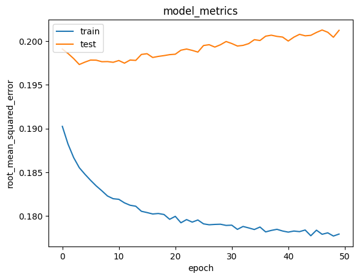
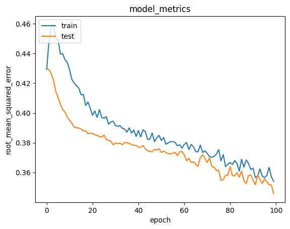

Laporan Proyek Machine Learning - Alwan Hasmadi

# Project Overview

Sistem pemberi rekomendasi atau sistem rekomendasi adalah subkelas dari sistem penyaringan informasi yang memberikan saran untuk item yang paling *relevan* dengan pengguna tertentu. [1] [2] Biasanya, saran mengacu pada berbagai proses pengambilan keputusan, seperti produk apa yang akan dibeli, musik apa yang akan didengarkan, atau berita online apa yang akan dibaca. [1] Sistem rekomendasi sangat berguna ketika seseorang perlu memilih item dari jumlah item yang mungkin ditawarkan oleh suatu layanan. [1] [3]

Sistem pemberi rekomendasi digunakan di berbagai area, dengan contoh umum yang dikenal dalam bentuk generator daftar putar untuk layanan video dan musik, pemberi rekomendasi produk untuk toko online, atau pemberi rekomendasi konten untuk *platform* media sosial dan pemberi rekomendasi konten web terbuka. [4] [5] Sistem ini dapat beroperasi menggunakan satu input, seperti musik, atau beberapa input di dalam dan lintas platform seperti berita, buku, dan permintaan pencarian. Ada juga sistem rekomendasi populer untuk topik tertentu seperti restoran dan kencan online . Sistem pemberi rekomendasi juga telah dikembangkan untuk mengeksplorasi artikel penelitian dan pakar, [6] kolaborator, [7] dan jasa keuangan. [8]

Banyaknya film yang telah diproduksi dari berbagai kategori seperti drama, komedi, horor, dan lain-lain menyebabkan penonton memiliki banyak pilihan film yang akan ditonton. Sistem rekomendasi merupakan sebuah sistem komputer yang membantu membuat suatu keputusan dengan memberikan saran kepada pengguna melalui pemrosesan data pada sistem. Dengan adanya pemanfaatan teknologi informasi dibutuhkan suatu sistem yang memudahkan penonton dalam memilih film yang ditonton. Tujuan dari kajian ini yaitu merancang sebuah sistem rekomendasi film bagi kalangan konsumen perfilman. [9]

# *Business Understanding*

Beberapa tujuan dan fungsi sistem rekomendasi secara umum adalah sebagai berikut:

- Meningkatkan jumlah item yang terjual.
Salah satu tujuan paling penting dari sistem rekomendasi di bidang komersial adalah meningkatkan jumlah item yang terjual. Tujuan ini bisa dicapai karena item yang direkomendasikan biasanya merupakan barang yang memang dibutuhkan oleh pengguna. Sementara itu, di bidang non-komersial peningkatan yang diharapkan dari sistem rekomendasi antara lain, *conversion rate*, click rate, dan jumlah kunjungan.

- Menjual item yang beragam.
Sistem rekomendasi memungkinkan pengguna untuk menemukan item yang sulit dicari. Sebagai contoh, organisasi atau bisnis tentu ingin mempromosikan semua item yang dimilikinya, tidak hanya item yang populer saja. Item non-populer seperti ini kadang tidak muncul di beranda item best-seller. Nah, organisasi atau bisnis bisa merekomendasikan item tersebut pada pengguna yang tepat. Dengan cara ini, item yang dijual pun tidak melulu item populer, melainkan lebih beragam.

- Meningkatkan kepuasan pengguna.
Sistem rekomendasi yang dirancang dengan baik dapat meningkatkan pengalaman pengguna saat menggunakan situs atau aplikasi. Pengguna akan menemukan rekomendasi yang menarik dan relevan. Kombinasi antara rekomendasi yang efektif dan akurat serta *user-interface* yang dirancang dengan baik akan meningkatkan kepuasan pengguna terhadap sistem. Sehingga, tingkat kemungkinan untuk rekomendasi tersebut diterima oleh pengguna juga semakin meningkat.

- Pemahaman yang lebih baik tentang preferensi pengguna
Deskripsi preferensi pengguna yang dikumpulkan secara eksplisit atau diprediksi oleh sistem dapat dimanfaatkan untuk berbagai aplikasi dan tujuan lain. Sebagai contoh, untuk meningkatkan pengelolaan stok barang atau items atau untuk mengiklankan promo tertentu pada sektor pengguna baru.

### Problem Statements (pernyataan masalah)
  - Berdasarkan data pengguna, Bagaimana membuat sistem rekomendasi yang dipersonalisasi, sehingga dapat meningkatkan kepuasan pengguna
  - Dengan data rating yang dimiliki, bagaimana caranya dapat merekomendasikan filem lain yang mungkin disukai dan belum pernah ditonton oleh pengguna. sehinnga dapat miningkatkan jumlah film yang terjual.

### Goals (tujuan)
  - Menghasilkan sejumlah rekomendasi film yang dipersonalisasi untuk pengguna dengan merekomendasikan film serupa yang pernah disukai atau ditonton dimasa lalu atau sedang ditonton dimasa kini.
  - Menghasilkan sejumlah rekomendasi film yang sesuai dengan preferensi pengguna dan belum pernah dikunjungi sebelumnya.

### Solution Approach
  - Solusi untuk dapat merekomendasikan pengguna yang dipersonalisasi dengan merekomendasikan film serupa yang pernah disukai atau ditonton dengan menggunakan tekink Content Based Filtering.
  - Solusi untuk menghasilkan sejumlah rekomendasi film yang sesuai dengan prefrensi pengguna dan belum pernah dikunjungi sebelumnya dengan menggunakan teknik Collaborative Filtering.

# Data Understanding
Data ini terdiri dari beberapa file yaitu :
- movies.csv : berisi data movieId, title dan genres, berjumlah 9742 data
- ratings.csv : berisi data userId, movieId, rating dan timestamp berjumlah 9742 data
- tags.csv : berisi data userId, movieId, tag dan timestamp, yang berjumlah 1572 data
- links.csv : berisi data movieId, imdbId dan tmdbId, berjumlah 9742 data


    Jumlah data movies  9742
    Jumlah data ratings  9724
    Jumlah data tags  1572
    Jumlah data links  9742


### Univariate Exploratory Data Analysis
Variabel - variabel pada MovieLens Latest small dataset adalah sebagai berikut :

- movies.csv
  - movieId : merpakan id dari data movie
  - title : merupakan title dari data movie
  - genres : merupakan genres dari data movie

- ratings.csv
  - userId : merpakan id data ratings
  - movieId : merupakan id refresni untuk data movies
  - rating : merupakan jumlah rating
  - timestamp : merupakan keterangan waktu

- tags.csv
  - userId : merupakan id refrensi untuk data ratings
  - movieId : merupakan id refrensi untuk data movies
  - tag : merupakan nama tag
  - timestamp : merupakan keterangan waktu

- links.csv
  - movieId : merupakan id refrensi untuk data movie
  - imdbId : merupakan id imdb movie
  - tmdbId : merupakan id tmdb mobie

#### Movies


```python
movies.info()
```

    <class 'pandas.core.frame.DataFrame'>
    RangeIndex: 9742 entries, 0 to 9741
    Data columns (total 3 columns):
     #   Column   Non-Null Count  Dtype 
    ---  ------   --------------  ----- 
     0   movieId  9742 non-null   int64 
     1   title    9742 non-null   object
     2   genres   9742 non-null   object
    dtypes: int64(1), object(2)
    memory usage: 228.5+ KB


#### Ratings


```python
ratings.info()
```

    <class 'pandas.core.frame.DataFrame'>
    RangeIndex: 100836 entries, 0 to 100835
    Data columns (total 4 columns):
     #   Column     Non-Null Count   Dtype  
    ---  ------     --------------   -----  
     0   userId     100836 non-null  int64  
     1   movieId    100836 non-null  int64  
     2   rating     100836 non-null  float64
     3   timestamp  100836 non-null  int64  
    dtypes: float64(1), int64(3)
    memory usage: 3.1 MB


#### Links


```python
links.info()
```

    <class 'pandas.core.frame.DataFrame'>
    RangeIndex: 9742 entries, 0 to 9741
    Data columns (total 3 columns):
     #   Column   Non-Null Count  Dtype  
    ---  ------   --------------  -----  
     0   movieId  9742 non-null   int64  
     1   imdbId   9742 non-null   int64  
     2   tmdbId   9734 non-null   float64
    dtypes: float64(1), int64(2)
    memory usage: 228.5 KB


#### Tags


```python
tags.info()
```

    <class 'pandas.core.frame.DataFrame'>
    RangeIndex: 3683 entries, 0 to 3682
    Data columns (total 4 columns):
     #   Column     Non-Null Count  Dtype 
    ---  ------     --------------  ----- 
     0   userId     3683 non-null   int64 
     1   movieId    3683 non-null   int64 
     2   tag        3683 non-null   object
     3   timestamp  3683 non-null   int64 
    dtypes: int64(3), object(1)
    memory usage: 115.2+ KB


Tabel 1. Daftar data ratings yang ada dalam dataset ratings.csv

|   #     | userId | movieId | rating | timestamp |
|--------|---------|--------|-----------|------------
| 0      | 1       | 1      | 4.0       | 964982703  |
| 1      | 1       | 3      | 4.0       | 964981247  |
| 2      | 1       | 6      | 4.0       | 964982224  |
| 3      | 1       | 47     | 5.0       | 964983815  |
| 4      | 1       | 50     | 5.0       | 964982931  |
| ...    | ...     | ...    | ...       | ...        |
| 100831 | 610     | 166534 | 4.0       | 1493848402 |
| 100832 | 610     | 168248 | 5.0       | 1493850091 |
| 100833 | 610     | 168250 | 5.0       | 1494273047 |
| 100834 | 610     | 168252 | 5.0       | 1493846352 |
| 100835 | 610     | 170875 | 3.0       | 1493846415 |

100836 rows × 4 columns

Dari tabel 1 dapat dilihat bahwa rating terdiri dari 4 kolom antara lain : 
- userId : identitas pengguna
- movieId : identitas movie
- rating : data rating movie
- timestamp : data waktu rating


#### Data movies

Table 2. Daftar movie yang ada dalam dataset movies.csv

| #       | movieId | title  | genres                                    |
|---------|--------|-------------------------------------------|---------------------|
| 0       | 1      | Toy Story (1995)                          | Adventure,Animation|Children|Comedy|Fantasy |
| 1       | 2      | Jumanji (1995)                            | Adventure,Children|Fantasy                  |
| 2       | 3      | Grumpier Old Men (1995)                   | Comedy|Romance                              |
| 3       | 4      | Waiting to Exhale (1995)                  | Comedy,Drama|Romance                        |
| 4       | 5      | Father of the Bride Part II (1995)        | Comedy                                      |
| ...     | ...    | ...                                       | ...                                         |
| 9737    | 193581 | Black Butler: Book of the Atlantic (2017) | Action,Animation|Comedy|Fantasy             |
| 9738    | 193583 | No Game No Life: Zero (2017)              | Animation,Comedy|Fantasy                    |
| 9739    | 193585 | Flint (2017)                              | Drama                                       |
| 9740    | 193587 | Bungo Stray Dogs: Dead Apple (2018)       | Action|Animation                            |
| 9741    | 193609 | Andrew Dice Clay: Dice Rules (1991)       | Comedy                                      |

9742 rows × 3 columns


#### Data ratings

Tabel 3. Daftar data ratings yang ada dalam dataset ratings.csv

|# | userId | movieId | rating | timestamp |
|--------|---------|--------|-----------|------------|
| 0      | 1       | 1      | 4.0       | 964982703  |
| 1      | 1       | 3      | 4.0       | 964981247  |
| 2      | 1       | 6      | 4.0       | 964982224  |
| 3      | 1       | 47     | 5.0       | 964983815  |
| 4      | 1       | 50     | 5.0       | 964982931  |
| ...    | ...     | ...    | ...       | ...        |
| 100831 | 610     | 166534 | 4.0       | 1493848402 |
| 100832 | 610     | 168248 | 5.0       | 1493850091 |
| 100833 | 610     | 168250 | 5.0       | 1494273047 |
| 100834 | 610     | 168252 | 5.0       | 1493846352 |
| 100835 | 610     | 170875 | 3.0       | 1493846415 |

100836 rows × 4 columns

#### Data Links


Tabel 4. Daftar data links yand ada dalam dataset links.csv


| # | movieId | imdbId | tmdbId  |
|---------|--------|---------|----------|
| 0       | 1      | 114709  | 862.0    |
| 1       | 2      | 113497  | 8844.0   |
| 2       | 3      | 113228  | 15602.0  |
| 3       | 4      | 114885  | 31357.0  |
| 4       | 5      | 113041  | 11862.0  |
| ...     | ...    | ...     | ...      |
| 9737    | 193581 | 5476944 | 432131.0 |
| 9738    | 193583 | 5914996 | 445030.0 |
| 9739    | 193585 | 6397426 | 479308.0 |
| 9740    | 193587 | 8391976 | 483455.0 |
| 9741    | 193609 | 101726  | 37891.0  |

9742 rows × 3 columns


#### Data Tags

Tabel 5. Daftar data tags yang ada dalam dataset tags.csv


| # | userId | movieId | tag    | timestamp        |
|--------|---------|--------|------------------|------------|
| 0      | 2       | 60756  | funny            | 1445714994 |
| 1      | 2       | 60756  | Highly quotable  | 1445714996 |
| 2      | 2       | 60756  | will ferrell     | 1445714992 |
| 3      | 2       | 89774  | Boxing story     | 1445715207 |
| 4      | 2       | 89774  | MMA              | 1445715200 |
| ...    | ...     | ...    | ...              | ...        |
| 3678   | 606     | 7382   | for katie        | 1171234019 |
| 3679   | 606     | 7936   | austere          | 1173392334 |
| 3680   | 610     | 3265   | gun fu           | 1493843984 |
| 3681   | 610     | 3265   | heroic bloodshed | 1493843978 |
| 3682   | 610     | 168248 | Heroic Bloodshed | 1493844270 |

3683 rows × 4 columns


Tabel 6. Data describe ratings

| #      | userId | movieId       | rating        | timestamp     |
|--------|---------------|---------------|---------------|--------------|
| count  | 100836.000000 | 100836.000000 | 100836.000000 | 1.008360e+05 |
| mean   | 326.127564    | 19435.295718  | 3.501557      | 1.205946e+09 |
| std    | 182.618491    | 35530.987199  | 1.042529      | 2.162610e+08 |
| min    | 1.000000      | 1.000000      | 0.500000      | 8.281246e+08 |
| 25%    | 177.000000    | 1199.000000   | 3.000000      | 1.019124e+09 |
| 50%    | 325.000000    | 2991.000000   | 3.500000      | 1.186087e+09 |
| 75%    | 477.000000    | 8122.000000   | 4.000000      | 1.435994e+09 |
| max    | 610.000000    | 193609.000000 | 5.000000      | 1.537799e+09 |

Dari tabel 6 dapa dilihat bahwa nilai maksimum rating adalah 5 dan nilai minimum rating adalah 0. Artinya, skala rating antara 1 sampai 5.

Jumlah userId:  610
Jumlah movieId:  9742
Jumlah data rating:  100836


# Data Processing

#### Mengetahui jumlah seluruh movie

    Jumlah seluruh data movies berdasarkan movieId:  9742


#### Mengetahui jumlah seluruh user berdasarkan rating

    Jumlah seluruh data users berdasarkan userId:  610


### Menggabungkan data movie


Tabel 7. Data gabungan movie

| # | userId | movieId | rating | timestamp | title      | genres                         |
|--------|---------|--------|-----------|------------|--------------------------------|--------------------|
| 0      | 1       | 1      | 4.0       | 964982703  | Toy Story (1995)               | Adventure,Animation,Children,Comedy,Fantasy |
| 1      | 1       | 1      | 4.0       | 964982703  | NaN                            | NaN                                         |
| 2      | 1       | 3      | 4.0       | 964981247  | Grumpier Old Men (1995)        | Comedy,Romance                              |
| 3      | 1       | 3      | 4.0       | 964981247  | NaN                            | NaN                                         |
| 4      | 1       | 6      | 4.0       | 964982224  | Heat (1995)                    | Action,Crime,Thriller                       |
| ...    | ...     | ...    | ...       | ...        | ...                            | ...                                         |
| 201667 | 610     | 168250 | 5.0       | 1494273047 | NaN                            | NaN                                         |
| 201668 | 610     | 168252 | 5.0       | 1493846352 | Logan (2017)                   | Action,Sci-Fi                               |
| 201669 | 610     | 168252 | 5.0       | 1493846352 | NaN                            | NaN                                         |
| 201670 | 610     | 170875 | 3.0       | 1493846415 | The Fate of the Furious (2017) | Action,Crime,Drama,Thriller                 |
| 201671 | 610     | 170875 | 3.0       | 1493846415 | NaN                            | NaN                                         |

201672 rows × 6 columns


Missing value data movie


Tabel 8. Data missing value dari data movie

    | Nama          | Value  |
    |---------------|--------|
    | userId        |    0   |
    | movieId       |    0   |
    | rating        |    0   |
    | timestamp     |    0   |
    | title         | 100836 |
    | genres        | 100836 |
    
Dari tabel 8 dapat dilihat jumlah missing value dari fitur masing-masing fitur


Menghitung jumlah rating berdasarkan movieId

Tabel 9. Jumlah rating berdasarkan movieId

| movieId | userId  | rating | timestamp |
|---------|--------|-----------|--------------|
| 1       | 131808 | 1686.0    | 485828910958 |
| 2       | 72502  | 755.0     | 249877166644 |
| 3       | 29494  | 339.0     | 104531468772 |
| 4       | 3078   | 33.0      | 12580104096  |
| 5       | 29358  | 301.0     | 97281105188  |
| ...     | ...    | ...       | ...          |
| 193581  | 368    | 8.0       | 3074218164   |
| 193583  | 368    | 7.0       | 3074219090   |
| 193585  | 368    | 7.0       | 3074219610   |
| 193587  | 368    | 7.0       | 3074220042   |
| 193609  | 662    | 8.0       | 3074315212   |

9724 rows × 3 columns


Tabel 10. Data gabungan movie

| # | userId | movieId | rating | timestamp | title      | genres                         |
|--------|---------|--------|-----------|------------|--------------------------------|---------|
| 0      | 1       | 1      | 4.0       | 964982703  | Toy Story (1995)               | Adventure,Animation,Children,Comedy,Fantasy |
| 1      | 1       | 1      | 4.0       | 964982703  | NaN                            | NaN                                         |
| 2      | 1       | 3      | 4.0       | 964981247  | Grumpier Old Men (1995)        | Comedy,Romance                              |
| 3      | 1       | 3      | 4.0       | 964981247  | NaN                            | NaN                                         |
| 4      | 1       | 6      | 4.0       | 964982224  | Heat (1995)                    | Action,Crime|Thriller                       |
| ...    | ...     | ...    | ...       | ...        | ...                            | ...                                         |
| 201667 | 610     | 168250 | 5.0       | 1494273047 | NaN                            | NaN                                         |
| 201668 | 610     | 168252 | 5.0       | 1493846352 | Logan (2017)                   | Action,Sci-Fi                               |
| 201669 | 610     | 168252 | 5.0       | 1493846352 | NaN                            | NaN                                         |
| 201670 | 610     | 170875 | 3.0       | 1493846415 | The Fate of the Furious (2017) | Action,Crime,Drama,Thriller                 |
| 201671 | 610     | 170875 | 3.0       | 1493846415 | NaN                            | NaN                                         |

201672 rows × 6 columns

Data pada tabel 10 merupakan data yang akan digunakan untuk membuat sistem rekomendasi


# Data Preparation
### Mengatasi Missing Value


Cek missing value


    userId            0
    movieId           0
    rating            0
    timestamp         0
    title        100836
    genres       100836
    dtype: int64


Tabel 11. Data movie yang sudah di bersihkan dari data null


| # | userId | movieId | rating | timestamp | title      | genres                         |
|--------|---------|--------|-----------|------------|--------------------------------|-----|
| 0      | 1       | 1      | 4.0       | 964982703  | Toy Story (1995)               | Adventure,Animation,Children,Comedy,Fantasy |
| 2      | 1       | 3      | 4.0       | 964981247  | Grumpier Old Men (1995)        | Comedy|Romance                              |
| 4      | 1       | 6      | 4.0       | 964982224  | Heat (1995)                    | Action|Crime|Thriller                       |
| 6      | 1       | 47     | 5.0       | 964983815  | Seven (a.k.a. Se7en) (1995)    | Mystery|Thriller                            |
| 8      | 1       | 50     | 5.0       | 964982931  | Usual Suspects, The (1995)     | Crime|Mystery|Thriller                      |
| ...    | ...     | ...    | ...       | ...        | ...                            | ...                                         |
| 201662 | 610     | 166534 | 4.0       | 1493848402 | Split (2017)                   | Drama|Horror|Thriller                       |
| 201664 | 610     | 168248 | 5.0       | 1493850091 | John Wick: Chapter Two (2017)  | Action|Crime|Thriller                       |
| 201666 | 610     | 168250 | 5.0       | 1494273047 | Get Out (2017)                 | Horror                                      |
| 201668 | 610     | 168252 | 5.0       | 1493846352 | Logan (2017)                   | Action|Sci-Fi                               |
| 201670 | 610     | 170875 | 3.0       | 1493846415 | The Fate of the Furious (2017) | Action,Crime,Drama,Thriller                 |

100836 rows × 6 columns

Pada tabel 11 merupakan data yang movie yang nilai nullnya sudah dihilangkan


Tabel 12. Data movie dengan fitur genre yang kompleks

| # | userId | movieId | rating | timestamp | title      | genres                                    |
|--------|---------|--------|-----------|------------|-------------------------------------------|---------|
| 0      | 1       | 1      | 4.0       | 964982703  | Toy Story (1995)                          | Adventure,Animation,Children,Comedy,Fantasy |
| 163062 | 517     | 1      | 4.0       | 1487954343 | Toy Story (1995)                          | Adventure,Animation,Children,Comedy,Fantasy |
| 61034  | 213     | 1      | 3.5       | 1316196157 | Toy Story (1995)                          | Adventure,Animation,Children,Comedy,Fantasy |
| 162164 | 514     | 1      | 4.0       | 1533872400 | Toy Story (1995)                          | Adventure,Animation,Children,Comedy,Fantasy |
| 61202  | 214     | 1      | 3.0       | 853937855  | Toy Story (1995)                          | Adventure,Animation,Children,Comedy,Fantasy |
| ...    | ...     | ...    | ...       | ...        | ...                                       | ...                                         |
| 54512  | 184     | 193581 | 4.0       | 1537109082 | Black Butler: Book of the Atlantic (2017) | Action,Animation,Comedy,Fantasy             |
| 54514  | 184     | 193583 | 3.5       | 1537109545 | No Game No Life: Zero (2017)              | Animation,Comedy,Fantasy                    |
| 54516  | 184     | 193585 | 3.5       | 1537109805 | Flint (2017)                              | Drama                                       |
| 54518  | 184     | 193587 | 3.5       | 1537110021 | Bungo Stray Dogs: Dead Apple (2018)       | Action|Animation                            |
| 102724 | 331     | 193609 | 4.0       | 1537157606 | Andrew Dice Clay: Dice Rules (1991)       | Comedy                                      |

100836 rows × 6 columns

Jumlah data movie   9724

Genre pada movie terlalu kompleks sehingga akan disederhanakan fitur genre dengan hanya mengambil genre yang pertama saja


Tabel 13. Data movie dengan fitur genre baru

| # | userId | movieId | rating | timestamp | title      | genres                                    | genre                                       |
|--------|---------|--------|-----------|------------|-------------------------------------------|---------------------------------------------|-----|
| 0      | 1       | 1      | 4.0       | 964982703  | Toy Story (1995)                          | Adventure,Animation,Children,Comedy,Fantasy | Adventure |
| 163062 | 517     | 1      | 4.0       | 1487954343 | Toy Story (1995)                          | Adventure,Animation,Children,Comedy,Fantasy | Adventure |
| 61034  | 213     | 1      | 3.5       | 1316196157 | Toy Story (1995)                          | Adventure,Animation,Children,Comedy,Fantasy | Adventure |
| 162164 | 514     | 1      | 4.0       | 1533872400 | Toy Story (1995)                          | Adventure,Animation,Children,Comedy,Fantasy | Adventure |
| 61202  | 214     | 1      | 3.0       | 853937855  | Toy Story (1995)                          | Adventure,Animation,Children,Comedy,Fantasy | Adventure |
| ...    | ...     | ...    | ...       | ...        | ...                                       | ...                                         | ...       |
| 54512  | 184     | 193581 | 4.0       | 1537109082 | Black Butler: Book of the Atlantic (2017) | Action,Animation,Comedy,Fantasy             | Action    |
| 54514  | 184     | 193583 | 3.5       | 1537109545 | No Game No Life: Zero (2017)              | Animation,Comedy,Fantasy                    | Animation |
| 54516  | 184     | 193585 | 3.5       | 1537109805 | Flint (2017)                              | Drama                                       | Drama     |
| 54518  | 184     | 193587 | 3.5       | 1537110021 | Bungo Stray Dogs: Dead Apple (2018)       | Action,Animation                            | Action    |
| 102724 | 331     | 193609 | 4.0       | 1537157606 | Andrew Dice Clay: Dice Rules (1991)       | Comedy                                      | Comedy    |

100836 rows × 7 columns


Tabel 14. Data movie yang sudah diurutkan berdasarkan movieId

| # | userId | movieId | rating | timestamp | title      | genres                                    | genre                                       |
|--------|---------|--------|-----------|------------|-------------------------------------------|---------------------------------------------|-----|
| 0      | 1       | 1      | 4.0       | 964982703  | Toy Story (1995)                          | Adventure,Animation,Children,Comedy,Fantasy | Adventure |
| 163062 | 517     | 1      | 4.0       | 1487954343 | Toy Story (1995)                          | Adventure,Animation,Children,Comedy,Fantasy | Adventure |
| 61034  | 213     | 1      | 3.5       | 1316196157 | Toy Story (1995)                          | Adventure,Animation,Children,Comedy,Fantasy | Adventure |
| 162164 | 514     | 1      | 4.0       | 1533872400 | Toy Story (1995)                          | Adventure,Animation,Children,Comedy,Fantasy | Adventure |
| 61202  | 214     | 1      | 3.0       | 853937855  | Toy Story (1995)                          | Adventure,Animation,Children,Comedy,Fantasy | Adventure |
| ...    | ...     | ...    | ...       | ...        | ...                                       | ...                                         | ...       |
| 54512  | 184     | 193581 | 4.0       | 1537109082 | Black Butler: Book of the Atlantic (2017) | Action,Animation,Comedy,Fantasy             | Action    |
| 54514  | 184     | 193583 | 3.5       | 1537109545 | No Game No Life: Zero (2017)              | Animation,Comedy,Fantasy                    | Animation |
| 54516  | 184     | 193585 | 3.5       | 1537109805 | Flint (2017)                              | Drama                                       | Drama     |
| 54518  | 184     | 193587 | 3.5       | 1537110021 | Bungo Stray Dogs: Dead Apple (2018)       | Action,Animation                            | Action    |
| 102724 | 331     | 193609 | 4.0       | 1537157606 | Andrew Dice Clay: Dice Rules (1991)       | Comedy                                      | Comedy    |

100836 rows × 7 columns=


Tabel 15. Tabel movie setelah drop duplicate data

| # | userId | movieId | rating | timestamp | title      | genres                                    | genre                                       |
|--------|---------|--------|-----------|------------|-------------------------------------------|---------------------------------------------|------|
| 0      | 1       | 1      | 4.0       | 964982703  | Toy Story (1995)                          | Adventure,Animation,Children,Comedy,Fantasy | Adventure |
| 84230  | 288     | 2      | 2.0       | 978467973  | Jumanji (1995)                            | Adventure,Children,Fantasy                  | Adventure |
| 86338  | 289     | 3      | 2.5       | 1143424657 | Grumpier Old Men (1995)                   | Comedy,Romance                              | Comedy    |
| 76358  | 262     | 4      | 1.0       | 840306203  | Waiting to Exhale (1995)                  | Comedy,Drama,Romance                        | Comedy    |
| 154448 | 483     | 5      | 2.5       | 1327277284 | Father of the Bride Part II (1995)        | Comedy                                      | Comedy    |
| ...    | ...     | ...    | ...       | ...        | ...                                       | ...                                         | ...       |
| 54512  | 184     | 193581 | 4.0       | 1537109082 | Black Butler: Book of the Atlantic (2017) | Action,Animation,Comedy,Fantasy             | Action    |
| 54514  | 184     | 193583 | 3.5       | 1537109545 | No Game No Life: Zero (2017)              | Animation|Comedy|Fantasy                    | Animation |
| 54516  | 184     | 193585 | 3.5       | 1537109805 | Flint (2017)                              | Drama                                       | Drama     |
| 54518  | 184     | 193587 | 3.5       | 1537110021 | Bungo Stray Dogs: Dead Apple (2018)       | Action|Animation                            | Action    |
| 102724 | 331     | 193609 | 4.0       | 1537157606 | Andrew Dice Clay: Dice Rules (1991)       | Comedy                                      | Comedy    |

9724 rows × 7 columns

Pada tabel 15 terlihat bahwa jumlah sebelum dilakukan drop duplicate sebanyak 100836 setelah di drop menjadi 9724 data


Tabel 16. Data dictionari

| #    | id   | title  | genre                                     |
|------|--------|-------------------------------------------|-----------|
| 0    | 1      | Toy Story (1995)                          | Adventure |
| 1    | 2      | Jumanji (1995)                            | Adventure |
| 2    | 3      | Grumpier Old Men (1995)                   | Comedy    |
| 3    | 4      | Waiting to Exhale (1995)                  | Comedy    |
| 4    | 5      | Father of the Bride Part II (1995)        | Comedy    |
| ...  | ...    | ...                                       | ...       |
| 9719 | 193581 | Black Butler: Book of the Atlantic (2017) | Action    |
| 9720 | 193583 | No Game No Life: Zero (2017)              | Animation |
| 9721 | 193585 | Flint (2017)                              | Drama     |
| 9722 | 193587 | Bungo Stray Dogs: Dead Apple (2018)       | Action    |
| 9723 | 193609 | Andrew Dice Clay: Dice Rules (1991)       | Comedy    |

Pada tabel 16 merupakan data yang akan dimasukkan ke dalam permodelan sistem rekomendasi *Content Based Filtering*


# Model Development dengan Content Based Filtering


Tabel 17. Sampel data movie

| # | id   | title  | genre                                    |
|------|--------|------------------------------------------|-----------|
| 8925 | 136503 | Tom and Jerry: Shiver Me Whiskers (2006) | Animation |
| 3512 | 4808   | Vanishing, The (1993)                    | Mystery   |
| 9353 | 162598 | Deepwater Horizon (2016)                 | Drama     |
| 9291 | 159403 | Neo Tokyo (1987)                         | Adventure |
| 4789 | 7150   | Stuck on You (2003)                      | Comedy    |


### TF-IDF Vectorizer

Metode TF-IDF merupakan suatu cara untuk memberikan bobot hubungan suatu kata (term) terhadap dokumen.

Pada tahap ini, akan dibuat sistem rekomendasi sederhana berdasarkan genre film menggunakan TF-IDF Vectoriczer


Data genre movie setelah melakukan tf-idf vectorizer


    array(['action', 'adventure', 'animation', 'children', 'comedy', 'crime',
           'documentary', 'drama', 'fantasy', 'fi', 'film', 'genres',
           'horror', 'listed', 'musical', 'mystery', 'no', 'noir', 'romance',
           'sci', 'thriller', 'war', 'western'], dtype=object)


Melakukan fit dan transformasi ke dalam bentuk matriks.

Output :   (9724, 23)

Ukuran matrix (9724, 23), Nilai 9724 merupakan ukuran data dan 22 merupakan matrik kategori movie. 

Kemudian mengibah vektor tf-idf ke dalam bentuk matriks dengan fungsi todense()

Tabel 18. Matriks tf-idf untuk bebrapa movie dan genre


| | mystery                                | noir | thriller | film | no  | musical | sci | animation | war | action | ... | fantasy | fi  | romance  | listed | adventure | documentary | western | children | genres | crime |
|----------------------------------------|------|----------|------|-----|---------|-----|-----------|-----|--------|-----|---------|-----|----------|--------|-----------|-------------|---------|----------|--------|-------|---|
| title                                  |
| Incredible Shrinking Man, The (1957)   | 0.0  | 0.0      | 0.0  | 0.0 | 0.0     | 0.0 | 0.707107  | 0.0 | 0.0    | 0.0 | ...     | 0.0 | 0.707107 | 0.0    | 0.0       | 0.0         | 0.0     | 0.0      | 0.0    | 0.0   | 0.0 |
| Fullmetal Alchemist 2018 (2017)        | 0.0  | 0.0      | 0.0  | 0.0 | 0.0     | 0.0 | 0.000000  | 0.0 | 0.0    | 1.0 | ...     | 0.0 | 0.000000 | 0.0    | 0.0       | 0.0         | 0.0     | 0.0      | 0.0    | 0.0   | 0.0 |
| Andromeda Strain, The (1971)           | 1.0  | 0.0      | 0.0  | 0.0 | 0.0     | 0.0 | 0.000000  | 0.0 | 0.0    | 0.0 | ...     | 0.0 | 0.000000 | 0.0    | 0.0       | 0.0         | 0.0     | 0.0      | 0.0    | 0.0   | 0.0 |
| Ladykillers, The (2004)                | 0.0  | 0.0      | 0.0  | 0.0 | 0.0     | 0.0 | 0.000000  | 0.0 | 0.0    | 0.0 | ...     | 0.0 | 0.000000 | 0.0    | 0.0       | 0.0         | 0.0     | 0.0      | 0.0    | 0.0   | 0.0 |
| Thor: Ragnarok (2017)                  | 0.0  | 0.0      | 0.0  | 0.0 | 0.0     | 0.0 | 0.000000  | 0.0 | 0.0    | 1.0 | ...     | 0.0 | 0.000000 | 0.0    | 0.0       | 0.0         | 0.0     | 0.0      | 0.0    | 0.0   | 0.0 |
| Beethoven (1992)                       | 0.0  | 0.0      | 0.0  | 0.0 | 0.0     | 0.0 | 0.000000  | 0.0 | 0.0    | 0.0 | ...     | 0.0 | 0.000000 | 0.0    | 0.0       | 0.0         | 0.0     | 0.0      | 1.0    | 0.0   | 0.0 |
| Hairspray (2007)                       | 0.0  | 0.0      | 0.0  | 0.0 | 0.0     | 0.0 | 0.000000  | 0.0 | 0.0    | 0.0 | ...     | 0.0 | 0.000000 | 0.0    | 0.0       | 0.0         | 0.0     | 0.0      | 0.0    | 0.0   | 0.0 |
| Going in Style (1979)                  | 0.0  | 0.0      | 0.0  | 0.0 | 0.0     | 0.0 | 0.000000  | 0.0 | 0.0    | 0.0 | ...     | 0.0 | 0.000000 | 0.0    | 0.0       | 0.0         | 0.0     | 0.0      | 0.0    | 0.0   | 0.0 |
| Midsummer Night's Sex Comedy, A (1982) | 0.0  | 0.0      | 0.0  | 0.0 | 0.0     | 0.0 | 0.000000  | 0.0 | 0.0    | 0.0 | ...     | 0.0 | 0.000000 | 0.0    | 0.0       | 0.0         | 0.0     | 0.0      | 0.0    | 0.0   | 0.0 |
| Invasion, The (2007)                   | 0.0  | 0.0      | 0.0  | 0.0 | 0.0     | 0.0 | 0.000000  | 0.0 | 0.0    | 1.0 | ...     | 0.0 | 0.000000 | 0.0    | 0.0       | 0.0         | 0.0     | 0.0      | 0.0    | 0.0   | 0.0 |


Output matriks di atas menujukan movie yang berjudul *Andromeda Strain, The (1971)* memiliki genre *mystery*, hal ini terlihat dari nilai matriks 1.0 pada kategori *mystery*.


### *Cosine Similarity*

Metode Cosine Similarity adalah mengukur kemiripan antara
dua dokumen atau teks. Pada Cosine Similarity dokumen atau
teks dianggap sebagai vector.

Menghitung derajat kesamaan (similarity degree) antar movie dengan teknik cosine similarity. Keluarannya berupa matriks kesamaan dalam bentuk array.

kemudian melihat matriks kesamaan setiap movie dengan menampilkan title movie dalam 5 sampel kolom (axis = 1) dan 10 sampel baris (axis=0).


    Shape: (9724, 9724)

Tabel 19. Matriks kesamaan setiap movie

| title                                                      | Frankenstein (1931) | If These Walls Could Talk 2 (2000) | American Pie (1999) | Mr Hublot (2013) | The Last Witch Hunter (2015) |
|------------------------------------------------------------|---------------------|------------------------------------|---------------------|------------------|------------------------------|
| title                                                      |
| Union: The Business Behind Getting High, The (2007)        | 0.0                 | 0.0                                | 1.0                 | 0.0              | 0.0                          |
| Diabolique (Les diaboliques) (1955)                        | 0.0                 | 0.0                                | 0.0                 | 0.0              | 0.0                          |
| Drag Me to Hell (2009)                                     | 0.0                 | 0.0                                | 1.0                 | 0.0              | 0.0                          |
| Deadpool 2 (2018)                                          | 0.0                 | 0.0                                | 0.0                 | 0.0              | 1.0                          |
| Terminal, The (2004)                                       | 0.0                 | 0.0                                | 1.0                 | 0.0              | 0.0                          |
| GLOW: The Story of the Gorgeous Ladies of Wrestling (2012) | 0.0                 | 0.0                                | 0.0                 | 0.0              | 0.0                          |
| Glory (1989)                                               | 1.0                 | 1.0                                | 0.0                 | 0.0              | 0.0                          |
| Larry Crowne (2011)                                        | 0.0                 | 0.0                                | 1.0                 | 0.0              | 0.0                          |
| Super Troopers (2001)                                      | 0.0                 | 0.0                                | 1.0                 | 0.0              | 0.0                          |
| 2046 (2004)                                                | 1.0                 | 1.0                                | 0.0                 | 0.0              | 0.0                          |


Mengidentifikasi kesamaan antara satu restoran dengan restoran lainnya.

Angka 1.0 ymengindikasikan bahwa movie pada kolom X (horizontal) memiliki kesamaan dengan movie pada baris Y (vertikal). Sebagai contoh, film *Union: The Business Behind Getting High, The (2007)* teridentifikasi sama (similar) dengan film *American Pie (1999)*.


### Mendapatkan Rekomendasi

Membuat fungsi resto_recommendations dengan beberapa parameter sebagai berikut:

- title : Nama film (index kemiripan dataframe).
- similarity_data : Dataframe mengenai similarity yang telah didefinisikan sebelumnya.
- items : Nama dan fitur yang digunakan untuk mendefinisikan kemiripan, dalam hal ini adalah 'title' dan 'genre'.
- k : Banyak rekomendasi yang ingin diberikan.


Hasil rekomendasi dari permodelan yang telah dibuat

dalam kasus ini akan dicari rekomendasi berdasarkan title film *Felon (2008)*


Tabel 20. Hasil rekomendasi film
| # | title | genre                                             |
|-------|---------------------------------------------------|-------|
| 0     | Wolf Creek (2005)                                 | Crime |
| 1     | Joint Security Area (Gongdong gyeongbi guyeok ... | Crime |
| 2     | Entrapment (1999)                                 | Crime |
| 3     | Time Lapse (2014)                                 | Crime |
| 4     | Secret in Their Eyes (2015)                       | Crime |


Dari tabel 20 dapat dilihat bahwa sistem memeberikan 5 rekomendasi film yang mirip dengan film *Felon (2008)*

# Model Development dengan Collaborative Filtering

### *Data Understanding*

Tabel 21. Daftar data rating
| # | userId | movieId | rating | timestamp |
|--------|---------|--------|-----------|------------|
| 0      | 1       | 1      | 4.0       | 964982703  |
| 1      | 1       | 3      | 4.0       | 964981247  |
| 2      | 1       | 6      | 4.0       | 964982224  |
| 3      | 1       | 47     | 5.0       | 964983815  |
| 4      | 1       | 50     | 5.0       | 964982931  |
| ...    | ...     | ...    | ...       | ...        |
| 100831 | 610     | 166534 | 4.0       | 1493848402 |
| 100832 | 610     | 168248 | 5.0       | 1493850091 |
| 100833 | 610     | 168250 | 5.0       | 1494273047 |
| 100834 | 610     | 168252 | 5.0       | 1493846352 |
| 100835 | 610     | 170875 | 3.0       | 1493846415 |

100836 rows × 4 columns


### *Data Preparation*

Berikut adalah hal-hal yang telah dilakukan pada tahap persiapan:

- Memahami data rating.
- Menyandikan (encode) fitur ‘userId’ dan 'movieId' ke dalam indeks integer.
- Memetakan ‘userId’ dan ‘movieId’ ke dataframe yang berkaitan.
- Mengecek beberapa hal dalam data seperti jumlah user, jumlah movie, kemudian mengubah nilai rating menjadi float. jumlah user
  - Jumlah user : 610
  - jumlah movie : 9724
  - Rating minimum : 0.5
  - Rating maksimum : 5.0

### Membagi Data untuk Training dan Validasi

Tabel 22. Cek dataset
| userId | movieId | rating | timestamp | user       | movie |
|--------|---------|--------|-----------|------------|-------|
| 67037  | 432     | 77866  | 4.5       | 1335139641 | 431   | 4730 |
| 42175  | 288     | 474    | 3.0       | 978465565  | 287   | 474  |
| 93850  | 599     | 4351   | 3.0       | 1498524542 | 598   | 2631 |
| 6187   | 42      | 2987   | 4.0       | 996262677  | 41    | 194  |
| 12229  | 75      | 1610   | 4.0       | 1158989841 | 74    | 727  |
| ...    | ...     | ...    | ...       | ...        | ...   | ...  |
| 6265   | 42      | 4005   | 4.0       | 996259059  | 41    | 1873 |
| 54886  | 364     | 141    | 4.0       | 869443367  | 363   | 524  |
| 76820  | 480     | 6867   | 4.0       | 1179163171 | 479   | 2240 |
| 860    | 6       | 981    | 3.0       | 845556567  | 5     | 712  |
| 15795  | 103     | 6711   | 5.0       | 1431957425 | 102   | 2046 |


Kemudian, data akan dibagi menjadi train dan validasi dengan komposisi 80:20. Namun data dipetakan (mapping) terlebih dahulu, data user dan resto menjadi satu value.


    [[ 431 4730]
     [ 287  474]
     [ 598 2631]
     ...
     [ 479 2240]
     [   5  712]
     [ 102 2046]] [0.88888889 0.55555556 0.55555556 ... 0.77777778 0.55555556 1.        ]


Data sudah siap dimasukkan ke salam model


### Proses Training

Pada tahap ini, model menghitung skor kecocokan antara pengguna dan movie dengan teknik embedding. Pertama, melakukan proses embedding terhadap data user dan movie. Selanjutnya, melakukan operasi perkalian dot product antara embedding user dan movie. Selain itu juga dapat menambahkan bias untuk setiap user dan movie. Skor kecocokan ditetapkan dalam skala [0,1] dengan fungsi aktivasi sigmoid.

Model ini menggunakan Binary Crossentropy untuk menghitung loss function, Adam (Adaptive Moment Estimation) sebagai optimizer, dan root mean squared error (RMSE) sebagai metrics evaluation.


### Mendapatkan Rekomendasi Movie

Untuk mendapatkan rekomendasi *movie*, ambil sampel user secara acak dan definisikan variabel *movie_not_visited* yang merupakan daftar *movie* yang belum pernah dikunjungi oleh pengguna. mengapa perlu menentukan daftar *movie_not_visited*? Hal ini karena daftar *movie_not_visited* inilah yang akan menjadi *movie* yang direkomendasikan. 

Sebelumnya, pengguna telah memberi rating pada beberapa *movie* yang telah mereka kunjungi. gunakan rating ini untuk membuat rekomendasi *movie* yang mungkin cocok untuk pengguna. *Movie* yang akan direkomendasikan adalah *movie* yang belum pernah dikunjungi oleh pengguna. Oleh karena itu, perlu membuat variabel *movie_not_visited* sebagai daftar *movie* untuk direkomendasikan pada pengguna. 

Ini adalah hasil rekomendasi *movie* dari sistem rekomendasi menggunakan metode *Collaborative Filtering*


    301/301 [==============================] - 0s 1ms/step
    Showing recommendations for users: 465
    ===========================
    Resto with high ratings from user
    --------------------------------
    Aliens (1986) : Action
    Apocalypse Now (1979) : Action
    Patton (1970) : Drama
    Blazing Saddles (1974) : Comedy
    M*A*S*H (a.k.a. MASH) (1970) : Comedy
    --------------------------------
    Top 10 resto recommendation
    --------------------------------
    Heidi Fleiss: Hollywood Madam (1995) : Documentary
    Paths of Glory (1957) : Drama
    Cruise, The (1998) : Documentary
    Jonah Who Will Be 25 in the Year 2000 (Jonas qui aura 25 ans en l'an 2000) (1976) : Comedy
    Stunt Man, The (1980) : Action
    Belle époque (1992) : Comedy
    Trial, The (Procès, Le) (1962) : Drama
    Adam's Rib (1949) : Comedy
    Bad Boy Bubby (1993) : Drama
    Enter the Void (2009) : Drama


# Evaluasi

### *Precision*

#### Untuk *Content Based Filtering* menggunakan metode *Precission*

Precision merupakan sebuah
pengujian dasar yang biasanya digunakan untuk menguji sistem rekomendasi [6]. TP atau
true positive berarti sistem yang menghasilkan informasi relevan, sedangkan FP atau false
positive berarti sistem yang menghasilkan seluruh item yang tersedia. Dengan kata lain,
precision merupakan pengujian yang membandingkan hasil dari sistem dengan informasi
yang diminta oleh pengguna. Precision dapat dihitung menggunakan persamaan (4).

$$ P = {TP \over TP+FP} * 100 $$

keterangan : 
- P = Precision
- TP = *True Positif* merupakan jumlah rekomendasi yang relevan
- FP = *False Positif* merupakan jumlah seluruh item yang tersedia

Rekomendasi filem menggunakan moteode *Content Based Filtering* ini berdasarkan 'genre' movie

Contoh perhitungan precision  

Rekomendasi berdaskan judul filem *Absent-Minded Professor, The (1961)* dengan genre *Children*

Tabel 23. Contoh hasil rekomendasi *Content Based Filtering* 

| # |                                      title |    genre |
|---|--------------------------------------------|----------|
| 1 | Dreamer: Inspired by a True Story (2005)   | Children |
| 2 |                 Ramona and Beezus (2010)   | Children |
| 3 |                 Mighty Ducks, The (1992)   | Children |
| 4 |          Another Cinderella Story (2008)   | Children |
| 5 |       Muppet Christmas Carol, The (1992)   | Children |


$$ P = {5/5} * 100 $$
$$ P = 100 $$

Nilai *Precision* adalah 100.0 %

Berikut hasil evaluasi *Content Based Filtering* dengan metode *Precission* dari 5 data

Tabel 24. Hasil evaluasi 5 data dengan metode *Precission*

| # | Title | Genre | Precision |
|---|-------|-------|-------------|
| 1 | Absent-Minded Professor, The (1961) | Children | 100% |
| 2 | In the Bedroom (2001) | Drama | 100% |
| 3 | Weirdsville (2007) | Comedy | 100% |
| 4 | Funny Girl (1968) | Drama | 100% |
| 5 | Only Angels Have Wings (1939) | Adventure | 100%|


### *RMSE*

#### Untuk *Collaborative Filtering* menggunakan metode *MSE*
RMSE (Root Mean Squared Error) adalah metrik evaluasi yang umum digunakan dalam pemodelan regresi untuk mengukur sejauh mana selisih antara nilai prediksi dan nilai sebenarnya. RMSE menghitung akar kuadrat dari rata-rata kesalahan kuadrat antara nilai prediksi dan nilai sebenarnya.

Rumus *RMSE* dapat dituliskan sebagai berikut:

$$ MSE = \sqrt{1/N \sum_{k=1}^n (y_p - y_a)^2 } $$


Keterangan:

N = jumlah dataset

ya = nilai sebenarnya

yp = nilai prediksi

Berikut hasil evaluasi *Collaborative Filtering* dengan metode *RMSE*


#### Visualisasi Metrik evalusai model



Gambar 1. Visuaslisasi Metriks proses training

Pada gambar 1 terlihat bahwa error rates pada training dataset rendah, dan error rates test cenderung meningkat artinya model overfitting, penyebabnya adalah model yang terlalu kompleks

Underfitting dan overfitting dapat diselesaikan dengan cara mengatur hyperparameter dari model.



Gambar 1. Visuaslisasi Metriks proses training

Dengan merubah nilai hyperparamter *embedding_size*: 32, *learning_rate*: 0.002, *batch_size*: 50, epoch: 100 Proses training model tidak begitu smooth dan model konvergen pada epochs sekitar 100. Dari proses ini,  diperoleh nilai error akhir sebesar sekitar 0.354 dan error pada data validasi sebesar 0.3457. Nilai tersebut cukup bagus untuk sistem rekomendasi.


# Kesimpulan

Dari percobaan yang telah dilakukan dapat disimpulak bahwa pada metode *Content Base Filtering* mempelajari profil minat pengguna atau berdasarkan  baru berdasarkan data dari objek yang telah dinilai sebelumnya oleh pengguna. Sedangkan, *Collaborative filtering* bergantung pada pendapat komunitas pengguna atau jumlah rating. Ia tidak memerlukan atribut untuk setiap itemnya seperti pada sistem berbasis konten. 

# Daftar Refrensi

1. Ricci, Francesco; Rokach, Lior; Shapira, Bracha (2022). "Recommender Systems: Techniques, Applications, and Challenges". In Ricci, Francesco; Rokach, Lior; Shapira, Bracha (eds.). Recommender Systems Handbook (3 ed.). New York: Springer. pp. 1–35. doi:10.1007/978-1-0716-2197-4_1. ISBN 978-1-0716-2196-7.
2. "playboy Lead Rise of Recommendation Engines - TIME". TIME.com. 27 May 2010. Archived from the original on May 30, 2010. Retrieved 1 June 2015.
3. Resnick, Paul, and Hal R. Varian. "Recommender systems." Communications of the ACM 40, no. 3 (1997): 56-58.
4. Pankaj Gupta, Ashish Goel, Jimmy Lin, Aneesh Sharma, Dong Wang, and Reza Bosagh Zadeh WTF:The who-to-follow system at Twitter, Proceedings of the 22nd international conference on World Wide Web
5. Baran, Remigiusz; Dziech, Andrzej; Zeja, Andrzej (2018-06-01). "A capable multimedia content discovery platform based on visual content analysis and intelligent data enrichment". Multimedia Tools and Applications. 77 (11): 14077–14091. doi:10.1007/s11042-017-5014-1. ISSN 1573-7721. S2CID 36511631.
6. H. Chen, A. G. Ororbia II, C. L. Giles ExpertSeer: a Keyphrase Based Expert Recommender for Digital Libraries, in arXiv preprint 2015
7. H. Chen, L. Gou, X. Zhang, C. Giles Collabseer: a search engine for collaboration discovery, in ACM/IEEE Joint Conference on Digital Libraries (JCDL) 2011
8. Alexander Felfernig, Klaus Isak, Kalman Szabo, Peter Zachar, The VITA Financial Services Sales Support Environment, in AAAI/IAAI 2007, pp. 1692-1699, Vancouver, Canada, 2007.
9. https://journal.untar.ac.id/index.php/computatio/article/view/17081

